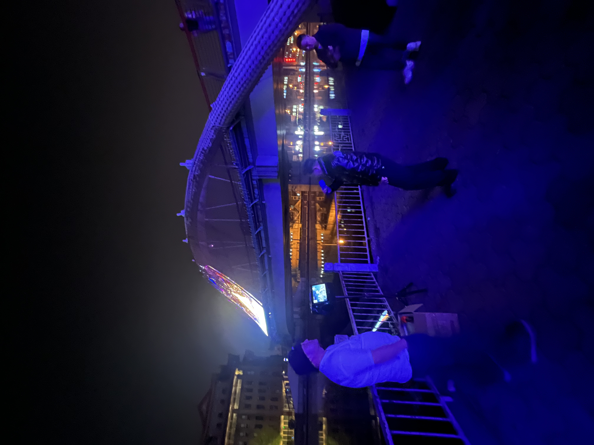
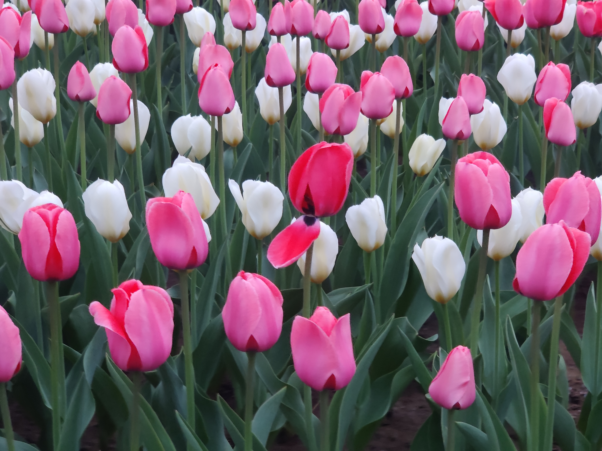
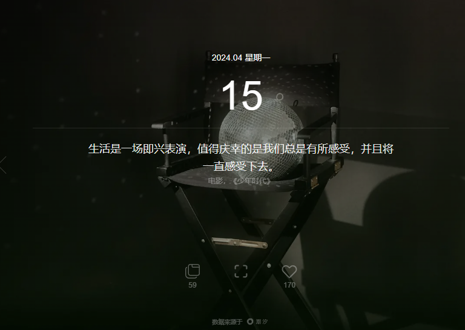
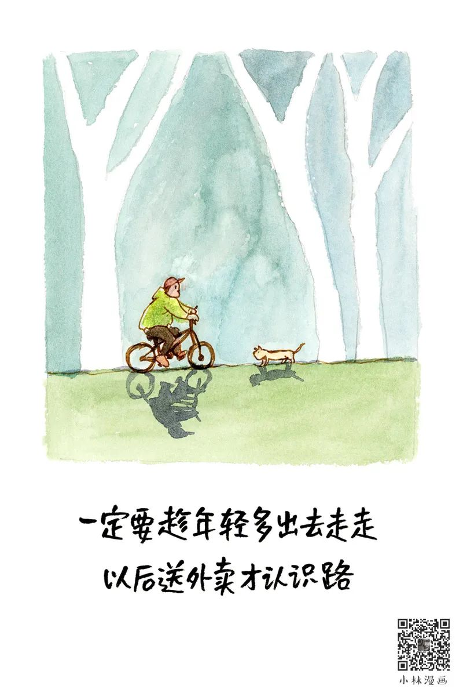
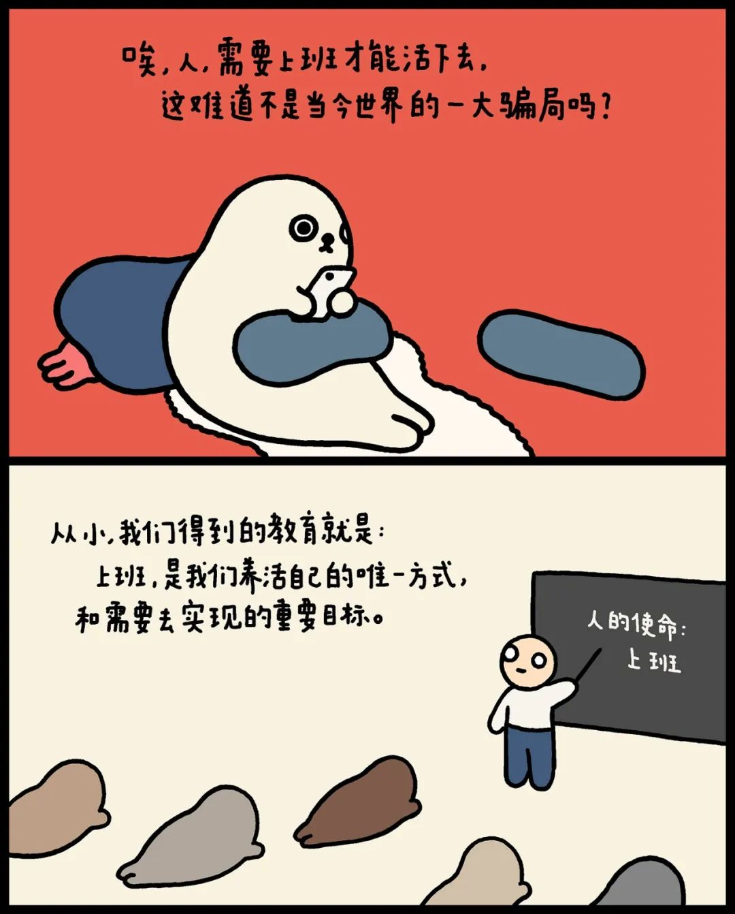
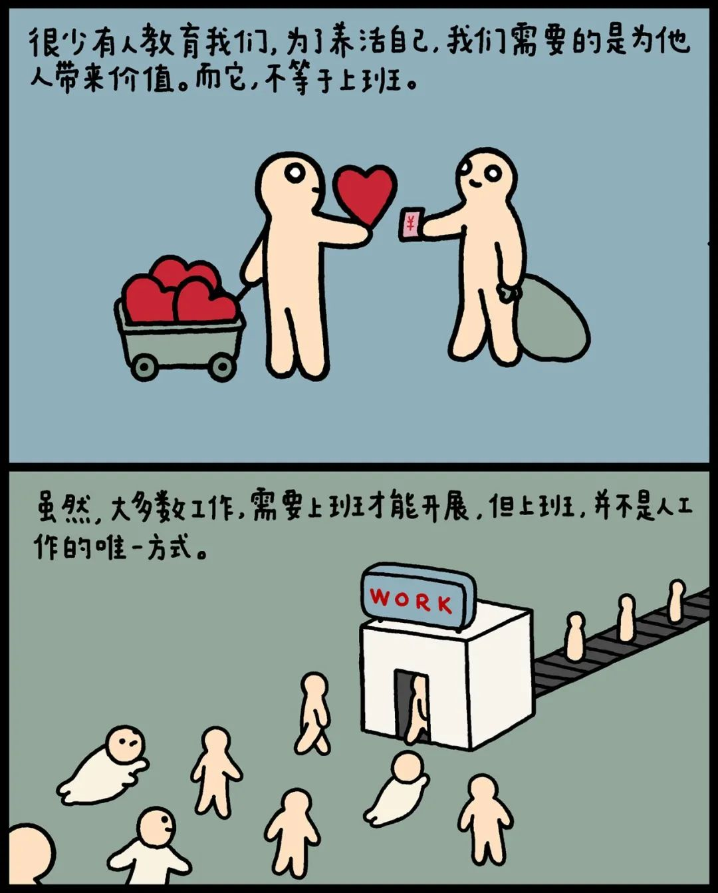
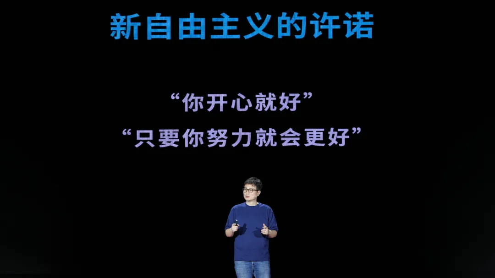
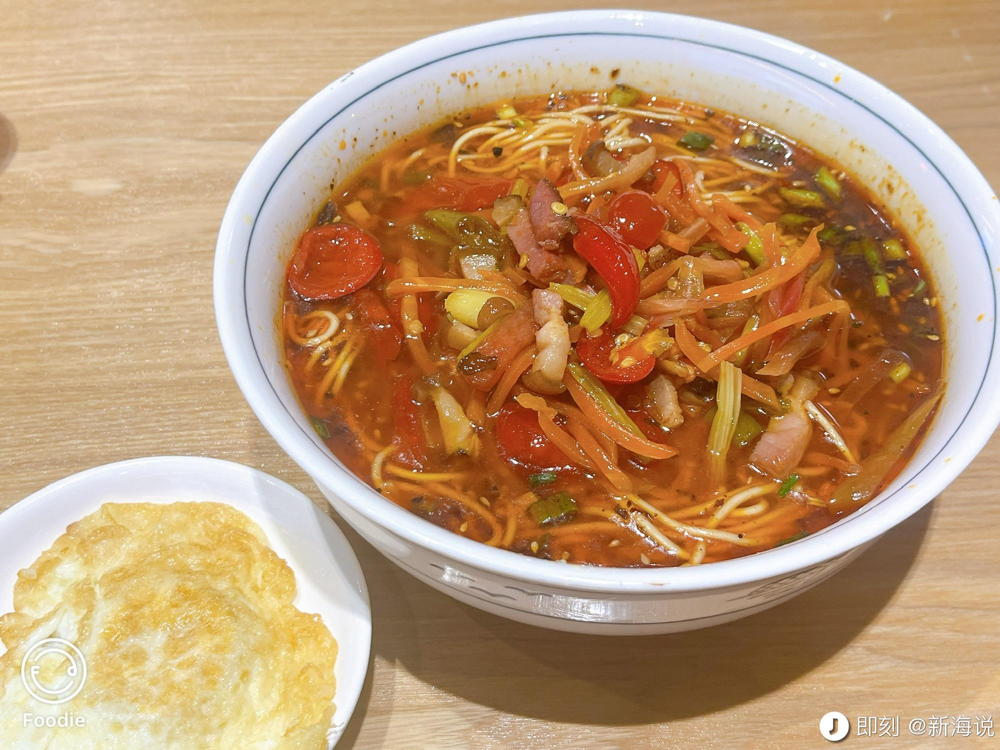
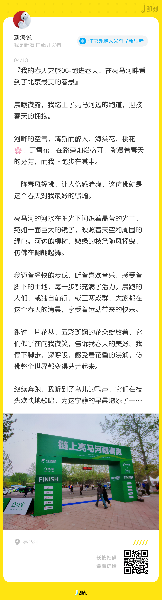

## **01 写在前面** {#2ef6628b00a18155a39bfb2f8d4b6118}

Hi，朋友，你好哦。

清明假期回来的这一周，感觉上周非常漫长，连续上了6天班，期待着周末好好休息一下，

于是在周末，我去完成了很多自己想去做的心愿清单。

欢迎你来阅读我的第28日周记。

## **02 本周最爱歌曲推荐** {#2ef6628b00a181518072c386ec6a9459}

**《每一步》**

> 曾踏过艰辛的每一步  
> 仍然前去  
> 仍然闯不理几高  
> 耳边的风声响  
> 像似歌声鼓舞  
> 努力为要走好我每步  
> 行尽了许多的崎岖路  
> 还前去才能知境界更高  
> 名利似有还无  
> 要想捉捉不到  
> 岁月在我身边笑着逃  
> 道路段段美好  
> 总是血与汗营造  
> 感激心中主宰每段道路为我铺  
> 但愿日后更好我愿永远莫停步  
> 我要闯出新绩要用实力做旗号

在周五晚上，处理完工作后，我去兴隆公园散步，在公园门口看到有两位大姐在跳鬼步舞，而背景音乐正是这首歌。

在听到这首歌之前，我正在思考故乡和北漂的关系，当我听到这首歌时，我好像找到一个答案，**前路未知，但最重要的是走好脚下的每一步。**

从兴隆公园出来后，我继续漫步，来到了通惠河旁边的高碑店公园，在河边看到有一群人正在唱歌，于是我也在河边唱了两首初中时学的两首歌《春天里》和《活着》，唱完心情好多了。

于是我决定，把我每周五定为我的唱歌日，去河边散步唱歌，通过音乐来休息放松一下。

## **03 本周拍的最喜欢的一张图** {#2ef6628b00a181bcbf20e385c701da26}

> 这张图是我在Soho的楼下拍到的郁金香，我很喜欢郁金香，看到它们盛开的样子，很开心。

## **04 本周最喜欢的一句话** {#2ef6628b00a1811d8f4cd6091ce86b24}

> **生活是一场即兴表演，值得庆幸的是我们总是有所感受，并且将一直感受下去。**  
> -电影-《少年时代》

这句话是来自iTab 的每日一言小组件。

## **05 本周读到** {#2ef6628b00a181d59e10c40843e91da1}

### 1.阅读的文章 {#2ef6628b00a181eb8135c15ac3fc61a7}

**1.《一定要趁年轻多出去走走》**

[https://mp.weixin.qq.com/s/kBZI9iI2HM2vbfC34sZNMA](https://mp.weixin.qq.com/s/kBZI9iI2HM2vbfC34sZNMA)

**阅读感悟：**小林的漫画温暖有趣，每期必追。

**2.《海豹漫画｜不想上班又没有钱，怎么办？》**

[https://mp.weixin.qq.com/s/jrEjJyfLxD4jFdIFIWpmPw](https://mp.weixin.qq.com/s/jrEjJyfLxD4jFdIFIWpmPw)

**阅读感悟：**我觉得我们讨厌的不一定是上班，而是讨厌的付出没有得到更好的回报，以及做的事情是否有价值，对我来说，现在如何从工作中积累成长，已经变成最重要的一个点。

**3.《王小伟：一个哲学视角的日常审查》**

[https://mp.weixin.qq.com/s/iBgG3ihHlHahIE24HxFTaw](https://mp.weixin.qq.com/s/iBgG3ihHlHahIE24HxFTaw)

**阅读感悟：**王小伟老师是我非常倾佩的一位老师，他在用他的视角去观察当下这个复杂的社会，他指出我们当代在城市打工的人时常被**通勤、外卖和手机**困住，他建议我们**把城市看作一座雨林，**每天花很多时间去观察绿化带里的鲜花盛开，观察单位楼下的野草生长，观察街心公园里的鸟鸣虫唱，观察这个城市的细节，观察城市在消费之外疯长的部分；建议**回到食物本身**，感受不同食物背后的细微味道；

也许我们还是得面对一个残缺的生存现实，我们也不得不承认个体在时代的浪潮面前具有软弱性，夺回日常注定是一场艰难的城市巷战。但也许人生的意义就在于，尽管很多的挣扎是徒劳的，我们还是要挣扎，人的金贵之处就在于此。

## **06 本周看到的新视频** {#2ef6628b00a181b89c7fee03e2813cb7}

**1.《逃源》**

**感悟：**3个年轻人，从城市到乡村，选择重新改造自己的居住地。

**2.《老狐狸》**

**感悟：**好人会成功吗？

## **06 本周新经历** {#2ef6628b00a181059e7bcedfce465ead}

**1.买到了可爱的chiikawa**

**2.吃到了恩施三绝的腊肉面**

**3 去朝阳公园春天晨跑**

## **07 本周新收获** {#2ef6628b00a18155b885d82e5c4a508e}

## **08 下周需改善和期待的点** {#2ef6628b00a181f6a45ac2cee11a58a0}

| **本周所期待的点**                                      | **结果**                                  |
| ------------------------------------------------ | --------------------------------------- |
| 1.工作上要进入一个新的领域-小程序，多去看看这个领域优秀的团队和产品，有哪些是我们可以学习的。 | 这个领域是国内app 增长点，自己还是需要多学习，跟团队把负责的项目有所突破。 |
| 2.学完剪映公开课，能剪辑一个短片。                               | 学完了第一个剪辑公开课，完成一个自己的小作品                  |
| 3.iTab与up主和国内优秀的AI 厂商合作                          | 后面iTab会跟天工AI后面会做一些事情                    |
| 4.去亮马河晨跑                                         | 周六的亮马河晨跑，感觉非常好                          |

| **本周所期待的点**                           |
| ------------------------------------- |
| 1.工作上会处理更多数据分析，提出一些新的方案，每天多去体验不同的畅销产品 |
| 2.再去学习剪辑更深入的课程，再剪辑出一个视频               |
| 3.去天津海边跑半马                            |
| 4.给我的初中好朋友写一封新婚祝福信和准备礼物               |

## **09 写在最后** {#2ef6628b00a181db8795e0b05ef85599}

上周的周记发布后，意外收到了几位朋友的赞助打赏，在此非常感谢！

不知不觉间，我写周记已经有一段时间了，我的状态也持续好起来了，心态的调整对当下的心情很重要，生活依旧在继续，后面，我会持续经历，记录，分享，谢谢大家。

在此，我给关注我的朋友剪辑了一个春天的礼物（视频）送给你。

**想到做到，得到世界的反馈，然后持续！**

我们，下周见。

2024/4/x 晚

北京

The End.

From 新海

