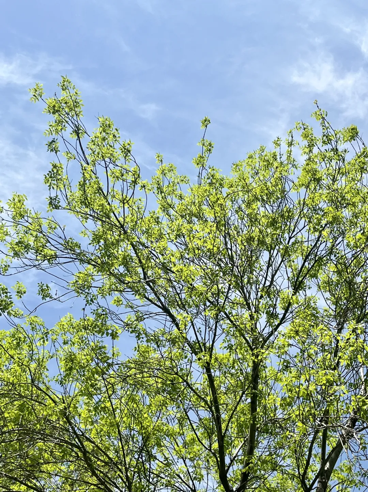
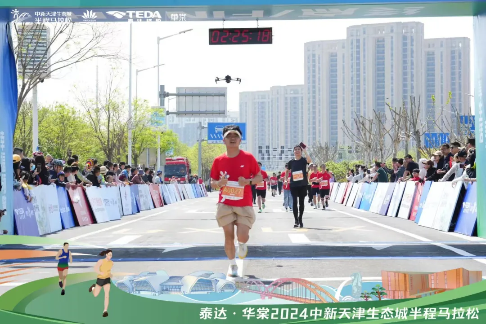
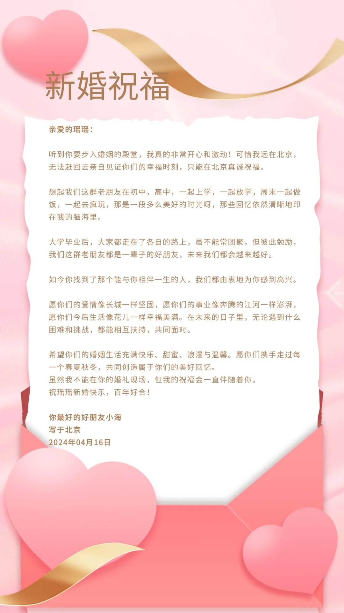
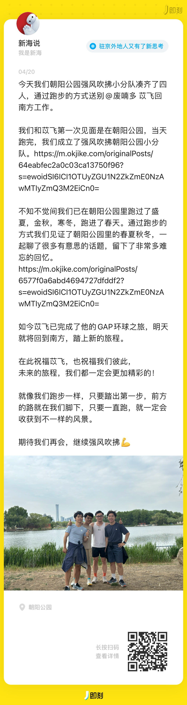
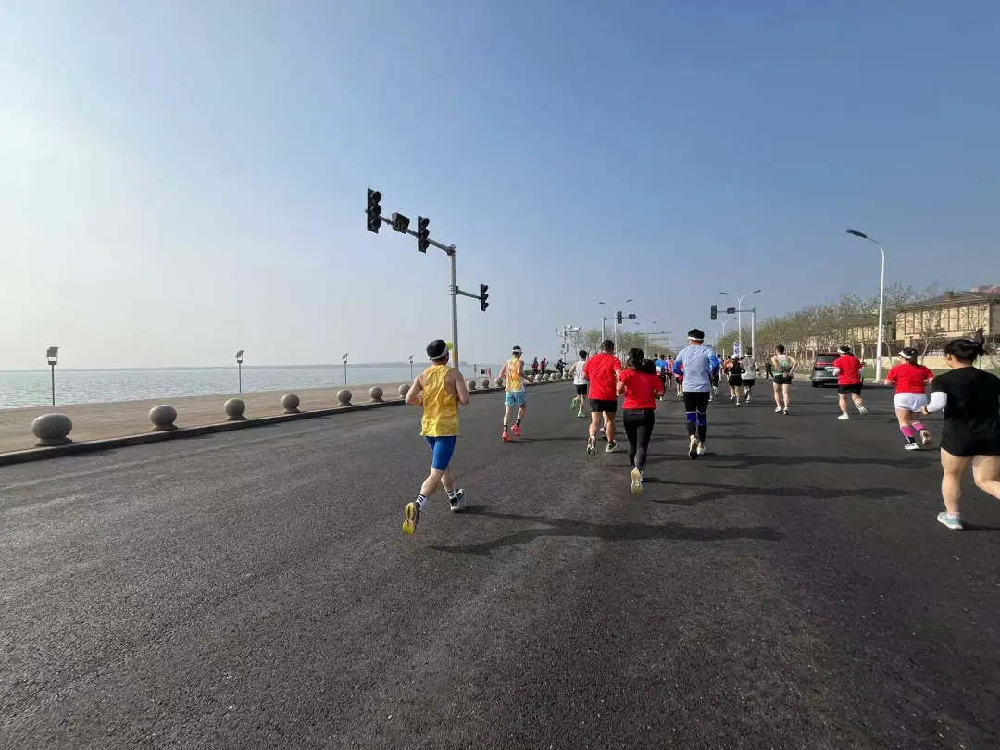
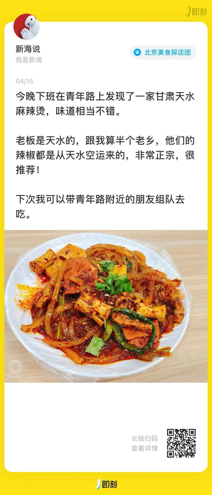

##  {#2ef6628b00a181adb16fd32170e982ce}

## **01 写在前面** {#2ef6628b00a181b99840f4bd62297df0}

Hi，朋友，你好哦。

最近这周北京的天气格外的好，一周之间仿佛入夏。

趁着天气好一点，我多出去走了走，完成了自己的一些心愿清单。

欢迎你来阅读我的第29期周记。

## **02 本周最爱歌曲推荐** {#2ef6628b00a1819b8cdaf621b8a4fc5f}

**《The Idiot》**

**The Idiot**,Seth Staton Watkins

> I often take these night shift walks when the foreman's not around

	I turn my back on the cooling stacks and make for open ground

	Far out beyond the tank farm fence where the gas flare makes no sound

	I forget the stink and I always think back to that Eastern town

	I remember back six years ago, this Western life I chose

	And every day, the news would say some factory's going to close

	Well, I could have stayed to take the Dole, but I'm not one of those

	I take nothing free, and that makes me an idiot, I suppose

	So I bid farewell to the Eastern town I never more will see

	But work I must so I eat this dust and breathe refinery

这首歌讲述了一个感人的故事，一个人离开家乡，做出了艰难的决定去西部寻找更好的生活。通过对家乡自然环境的怀念、个人自由与自我认同的探索、拒绝依赖社会福利的心态、对家乡变迁的感慨以及对个人生活选择的反思等方面，作者表达了对家乡的深切思念和个人生活的深刻反思，像极了我们北漂的现状。

**03 本周拍的最喜欢的一张图**

> 完赛今年第一场海边马拉松。

## **04 本周最喜欢的一句话** {#2ef6628b00a18162b273d76b3d058539}

> 我心即是宇宙，宇宙即是我心

我心里怎么想，我的世界就是什么样。

## **05 本周看到的新视频** {#2ef6628b00a181f2ab73e1843500c4d3}

**1.《什么是生活》**

**GrayDesign**

，赞1105

**感悟：**生活总有不如意的时候，但“关关难过关关过”

**2.《平凡英雄》**

**成宝追剧**

，赞10万+

**感悟：**今年第一部看哭的影片。

**06 本周新经历**

**1.给初高中好朋友准备新婚祝福和礼物**

**2.在朝阳公园一起跑步方式送别北漂6年的苡飞回南方工作**

**3.去海边跑马拉松**

**4.发现了青年路上最好吃的天水麻辣烫**

## **07下周期待的点** {#2ef6628b00a1819c95c9efe41f6fb141}

**本周所期待的点**

---

1.本周姐姐即将生宝宝了

---

2.继续学习剪辑视频

---

3.制定自己的减肥运动计划

---

4.多体验榜单上优秀的产品

---

## **08写在最后** {#2ef6628b00a1812c8646d4528022e940}

生活本身有很多值得我们期待的事情，有些是想做，有些是能做，还有一些是必须做。

时常去分类好这些事情，把自己精力投入到这些事情上。

**想到做到，得到世界的反馈，然后持续！**

我们，下周见。

2024/4/21 晚

北京

The End.

From 新海

