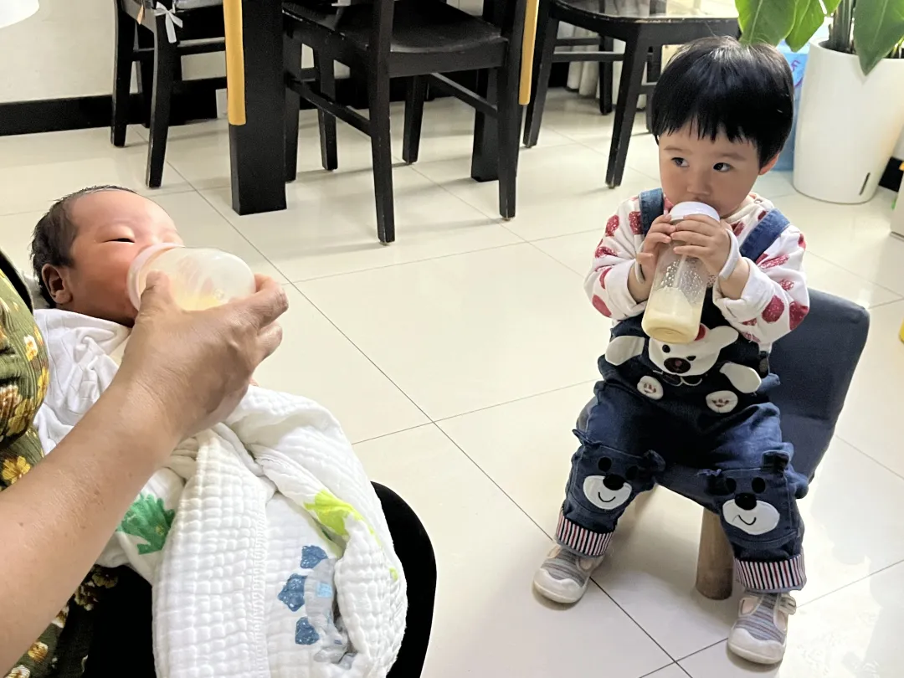
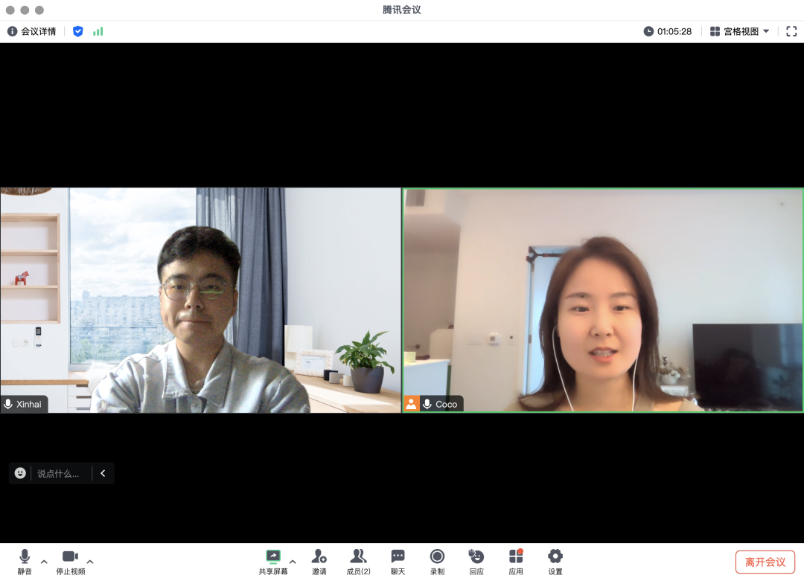
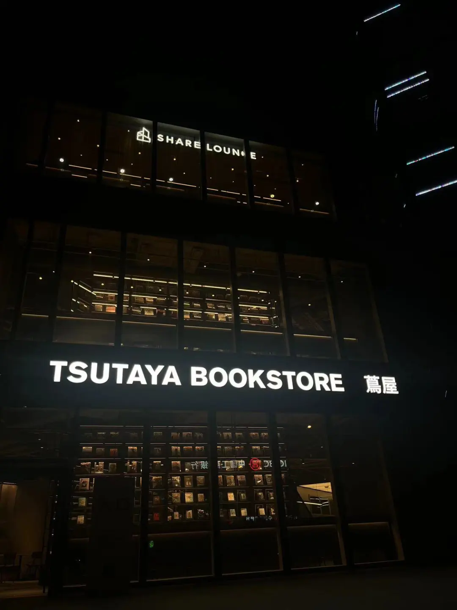

## **01 写在前面** {#2ef6628b00a1811b9205d77f5dd1e179}

Hi，朋友，你好哦。

马上就要到五一假期了，在这里提前祝你假期快乐。

生活依旧再继续，欢迎你来阅读我的第30期周记。

**02 本周最爱歌曲推荐**

**《小霞》**

**小霞**,小霞

> 

	- 一九六八年春天，爸爸第一次捧我的脸，睁开眼睛，原来这就是世界。

		车水马龙中穿行的女孩，他在等她送来的烟纸盒，真的很像电影里的情节。

		小霞，小霞，记忆清晰吗？小霞，小霞，空气的味道还记得吧？

		十五岁青葱的少年，而我与他们越走越远，我忘不掉那一刻你们的眼。

		车间里交响着的轰鸣，糖果纸多彩又绚丽，却没能包裹住那不安的命运。

		哦，小霞，小霞，世界复杂吗？小霞，小霞，你真勇敢啊！

		……

我今年很喜欢的一位歌手是黄绮珊，她的艺名叫小霞。这首歌就像她的自传，从出生到长大，这一路上她越走越远，她也真的长大了。

这个世界很复杂，小霞，你真勇敢啊！

这周我的小侄子平安出生了，姐姐真勇敢！

**03 本周拍的最喜欢的一张图**

> 姐姐家里两个宝娃一起喝奶的样子真可爱。

## **04 本周最喜欢的一句话** {#2ef6628b00a181819dd0e92972ada5f6}

> 保持对世界的好奇心,你才会捡到更多“贝壳”。

周天和小河教练交流完，她让我把生活中无聊时刻换为好奇心时刻，然后去更深远的内心世界探索，这仿佛给我开启了一个新世界。

只要我们对世界好奇，就会打开很多门，后面我会围绕好奇心，写一篇文章来详细展开。

## **05 本周看到的新视频** {#2ef6628b00a181ef8574e18b89f4a4ae}

**1.《世界第一城东京》**

**感悟：**这个视频很好的介绍了东京大都会的城市风貌，非常想去看看。

**2.《随机赞美路人》**

**感悟：**真诚地赞美总是那么美好。

**06 本周新经历**

**1.姐姐喜得贵子，我们全家人都很开心。**

**2.周天和小河教练交流，收获很多，特别想感谢**

**3.参与负责的产品进入了国内小游戏畅销榜前50**

**4.发现了青年路上最好吃的肠粉**

**5.朝阳门新开了北京第一家茑屋书店**

## **07 下周期待的点** {#2ef6628b00a1810f8949d4143722a19b}

**下周所期待的点**

---

1.五一放假

---

2.去草莓音乐节摆摊/露营

---

3.去一个人少的地方待待

---

4.多体验榜单上优秀的产品

---

## **08 写在最后** {#2ef6628b00a1819cacf1d7c6f56aeee3}

大家也可以列一列自己的五一心愿清单，然后利用这个假期把它们实现。

最后祝大家五一快乐。

**想到做到，得到世界的反馈，然后持续！**

我们，下周见。

2024/4/28 晚

北京

The End.

From 新海

