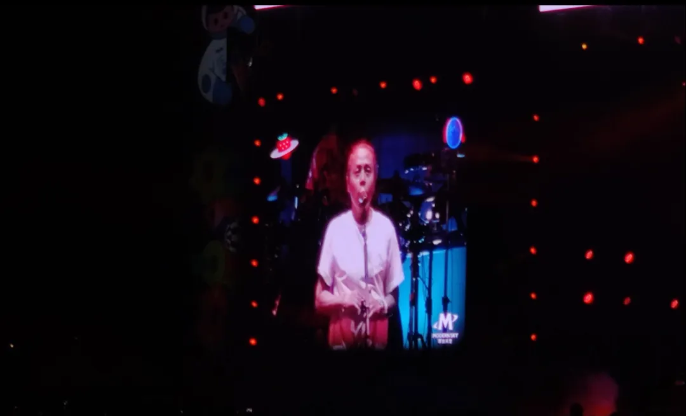
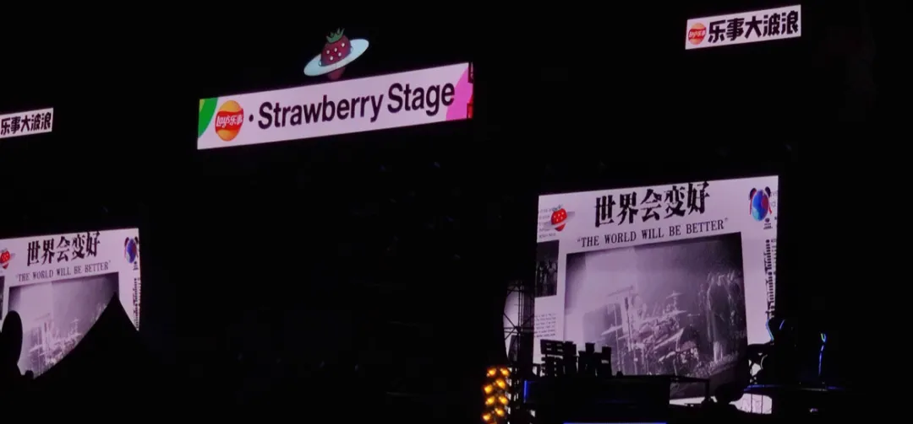
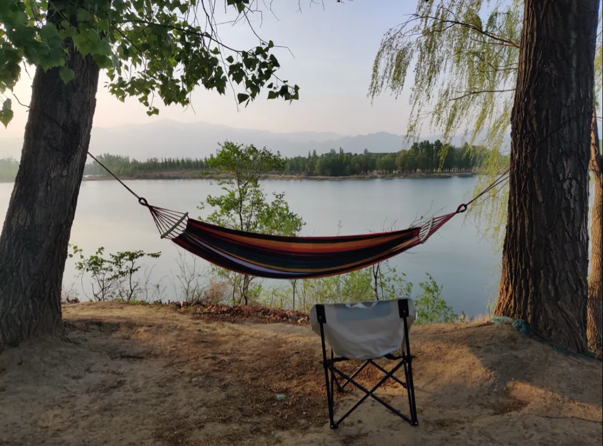
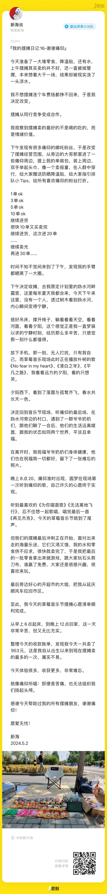
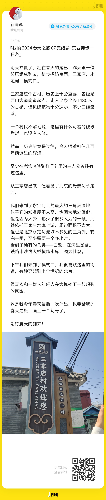
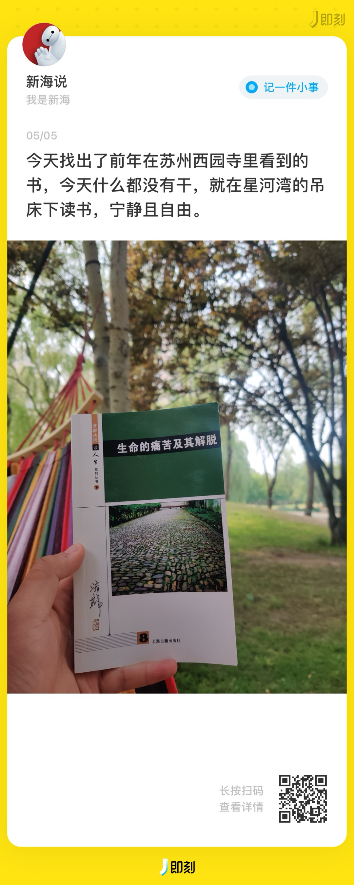
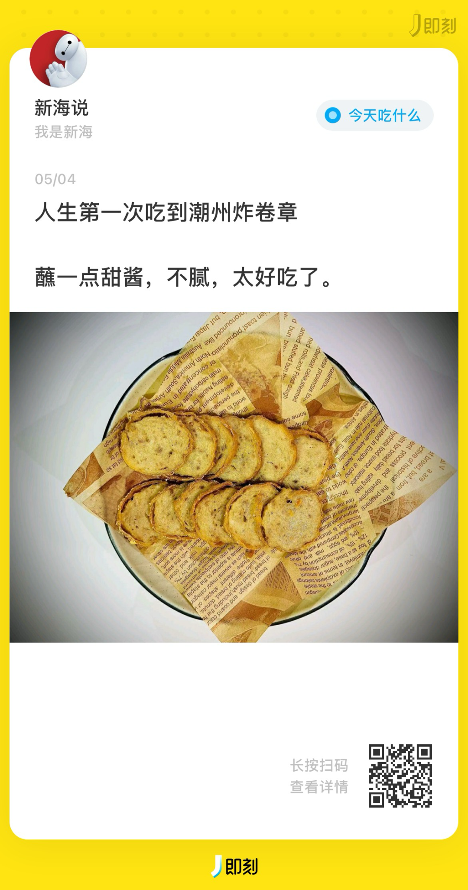

##  {#2ef6628b00a181d4bbe3ca5894c994f6}

## **01 写在前面** {#2ef6628b00a181d28ba0cc0c2857ddde}

Hi，朋友，你好哦。

5.5 日迎来了立夏的节气，不知不觉间我们告别了五一假期，也告别了春天，迎来了初夏。

关于今年春天，有2个词一直浮现我的脑海里，一个是忧郁，一个是希望，就像北京的天气一样。

关于夏天，我希望自己能开心一些，热烈地投入夏天。

关于这个五一假期，我更多是自己跟自己对话，休息好后，整理好自己，决定重新出发！

欢迎你来阅读我的第31期周记。

**02 本周最爱歌曲推荐**

**《为你唱首歌》**

**为你唱首歌**,痛仰乐队

> 一段危险的旅途结束

	我要和你平静地生活

	去看看天边日落

	或许幸福就是紧握的手

	甜蜜的笑

	哭泣时的拥抱

	莎菲娜 莎菲娜 哭泣时的拥抱

	莎菲娜 莎菲娜 哭泣时的拥抱

	万花筒点缀你炫目的瞳孔

	湛蓝天空会因为你而出现彩虹

	五彩斑斓的世界

	流连得已太久

	只有我才懂得你珍贵

	……

因为草莓音乐节，让我重新认识了痛仰乐队，理解了他们所唱的歌。

**即使苦痛,也无法阻止我们仰起的头颅!**

**03 本周拍的最喜欢的一张图**

> 摆摊结束后，在世园会妫水河畔的森林里露营，看着对面天空，夕阳，河流，内心特别宁静。

## **04 本周最喜欢的一句话** {#2ef6628b00a181c7a2e2c5d658d699c6}

> 杂乱无章的生活，需要整理来拯救。

这周在家里整理家务时，突然意识到，我们家里的物品需要时常整理，才能变得有序整齐 ，而我的内心，目标，在做的事情，朋友，资产也需要时常“整理”。

我们的精力和时间都是有限的，通过整理保留对于自己最重要的部分，然后尽情投入。

**05 本周看到的新视频**

**1.《大魔术师》**

**哔哩哔哩**

，赞10万+

**感悟：**这段时间的网络热点新闻完全都可以用这个短片来讽刺，很多时候我们看到热点新闻毫无营养，目前我是通过搜索来代替它们的推荐。

**2.《2024草莓音乐节》**

**摩登天空**

，赞987

**感悟：**音乐总会让人开心，这个夏天需要音乐。

**3.《小众城市爆火的流量密码》**

**破产兄弟BrokeBros**

，赞509

**感悟：**先是淄博，再是尔滨，而后天水，它们爆火的秘籍，这位up 主总结是【性价比+人情味+历史感】x 视频化

**06 五一新经历**

**本周所期待的点**

---

1.五一放假-✅

---

2.去草莓音乐节摆摊/露营✅

---

3.去一个人少的地方待待✅

---

4.多体验榜单上优秀的产品✅

---

**1.去草莓音乐节摆摊，挣了953**

**2.去和一位智者徒步探索京西**

**3.在吊床下读书，与自己对话**

**4.人生第一次吃潮州炸卷章，好吃！**

## **07 下周期待的点** {#2ef6628b00a1816ab066c748d44530ab}

**下周所期待的点**

---

1.调整状态，投入工作

---

2.iTab 新的视频发布，希望能被更多人看到

---

3.整理自己夏天的目标，然后积极行动

---

4.多体验榜单上优秀的产品

---

## **08 写在最后** {#2ef6628b00a1818a8541d7cb13e4043b}

世界纷繁复杂，我们不可能关注所有信息，我们需要整理出对自己最重要的信息，关照自己内心，找到自己真正想要，把当下当作自己喜欢的时刻，然后尽情投入。

虽然五一假期结束了，但如果能找到自己喜欢想要的事情，**你的“假期”将被无限延长！**

**想到做到，得到世界的反馈，然后持续！**

我们，下周见。

2024/5/5 晚

北京

The End.

From 新海

