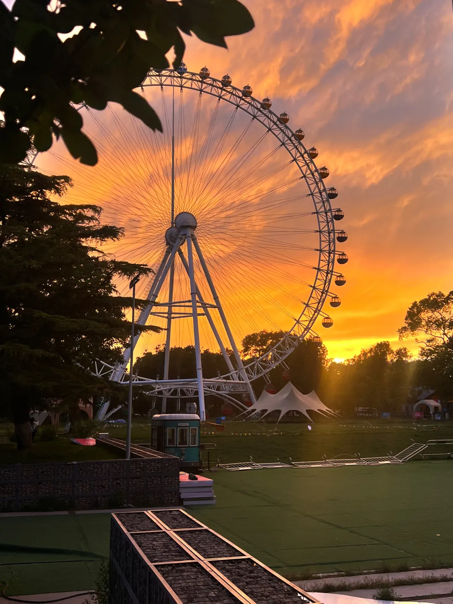
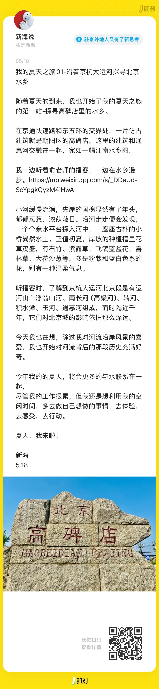

## **01 写在前面** {#2ef6628b00a181c28a5acf1444256344}

Hi，朋友，你好哦。

今天是小满的节气，它是夏天的第二个节气。

今天也是520，在这个节点，我也想聊聊爱人与爱自己的关系。

欢迎你来阅读我的第33期周记。

**02 上周最爱歌曲推荐**

**《向云端》**

**向云端**,小霞

> 向云端

	山那边

	海里面

	真实的我应该走向哪边

	日落前

	风来临

	石墩下我在盘腿坐着

	人到底靠什么来定义丑恶

	神啊你在哪

	山啊我害怕

	海啊也带不走

	尽头到底有没有

	如果你很难过

	不如先收拾你的房间

	别再辗转反侧

	等会儿阳光会照在你的旁边

	……

上周五加班回家，当时很疲惫，听到了这首歌后，让我得到了治愈，歌词也给我了一些生活的答案。

比如歌词里说，如果难过的时候，就去收拾房间。

也许你现在很迷茫，真实的你，在于自己的选择。

**03 上周拍的最喜欢的照片**

> 上周北京出现了今年夏天最美的霞光夕阳；

> 周末在外面吃饭时，看到一位外国妈妈和她的孩子在给一对中国情侣拍照，恰好我记录了她们拍照的瞬间，在那一刻，我看到了人与人之间那种最纯粹的善意，跟肤色国籍无关，是人内心深处的善良。

## **04 上周感悟最深的一句话** {#2ef6628b00a181029768c65aed563a29}

> 爱人，更要爱自己

在上学时，我们很少接受关于爱的教育。

什么是爱？爱的本质是什么？爱是一种什么样的感受？怎么样算是爱自己？为什么要爱其他人？如何去爱其他人？我怎么知道这就是爱？

关于这些疑问，我得到的答案是：爱是一种自我生长的感觉。当你想实现爱自己时，爱自己是目的，但这个目的却必须通过爱它来实现。此时，爱他人也是是实现爱自己的过程。

爱自己就让“与自己有关系的人或事物”好起来。

比如，你有一件喜欢的衣服，在爱护自己的衣服的过程，达到了爱自己的目的。这有两个前提。一个是“你的”，一个是喜欢。两个都满足你才能让你的自我延伸到衣服上。爱自己的衣服，让衣服保持干净，叠好放好防止变形等等……

这个过程就像对事物的移情，事物成为了自我的一部分。此时，爱事物，就像爱自我的一部分。

同样，对于人也是如此。爱他人，是希望与自己有关系的人能更好一些。

爱与你有关系的人，是“你的”人。什么是“你的”？比如，“你的”父母，“你的”同学，“你的”老师，“你的”社会，“你的”国家，你生活中的一切……

“我希望世界在我死去时比我出生时更加美好”当世界成为自我的一部分，这也是一种爱自己。我衷心的祝福世界变得更加美好。

举个例子，父母成为了自我的一部分时，爱父母就是爱自己。父母的快乐就是我的快乐，父母生活的幸福，我才能幸福。想一想，你爱的人痛苦时你也会不由自主的感到痛苦，是不是？当你爱时，所爱之人的痛苦难过幸福快乐都与你息息相关。

“无尽的远方，无数的人们，都与我有关。”鲁迅的心中，应该是充满了爱吧。

**05 上周喜欢的视频**

**1.《三只小狗过水渠》**

**猛犸视频**

，赞10万+

**感悟：**同情最后到达的那只小狗，不同选择，吃的苦真的不一样。

**2.《爱自己的20种方式》**

**央视新闻**

，赞1.2万

**感悟：**爱他人很重要，但爱自己更需要。

**3.《小朋友的鼓励》**

**每天学英语口语**

，赞5264

**感悟：**很暖心的鼓励，就像小朋友所说，你想去做什么，就去做就好。

**06 上周新经历**

**1.战地叛逆连队2通关**

**感悟：**这是一款十几年前DICE开发的游戏，现在玩依旧比我们中国的游戏更有代入感。游戏已经是我生活方式的一种，体验更多好玩的游戏，也是众多人生体验的一种。

**2.开启了我的夏天之旅**

**3.亮马河City Walk**

**07 下周期待的点**

**上周所期待的点**

---

1.

工作上，学习更多优秀的产品的设计思路

- 

ing

---

2.

夏天的第一场鸟巢或公园摆摊-×

---

3.整理自己夏天的目标，然后积极行动- ing

---

4.新买一套夏天的衣服-ing

---

##  {#2ef6628b00a181aabcb5cc5fa90b8998}

**本周所期待的点**

---

1.工作上，学习更多优秀的产品的设计思路

---

2.参与助力好朋友Jie的微软高考项目

---

3.继续列出自己 2024 年夏天心愿清单

---

4.欢乐谷水世界开馆一日游

5.会与小河教练沟通关于爱的理解

---

**08 写在最后**

关于什么是爱，我也还在探索。

最近的感受是，不要经常责备自己，听一听内心的情绪，找一些取悦自己的事情去做。

最重要的是行动起来，可以是运动，可以是走出去，也可以是整理房间……，但千万不要躺着玩手机🤳🏻。

然后当自己有能量后，去爱自己的家人，朋友，以及需要帮助的人，让自己开心，身边的人愉悦。

**想到做到，得到世界的反馈，然后持续！**

我们，下周见。

2024/5/20午

北京

The End.

From 新海

