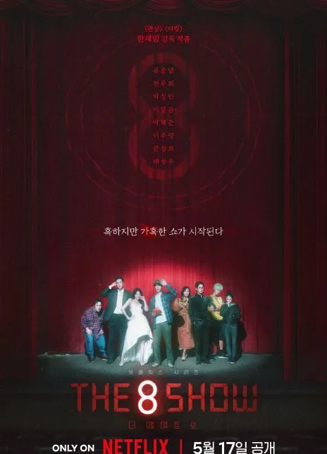

## **01 写在前面** {#2ef6628b00a181e6af05d72ab2ce98b6}

Hi，朋友，你好哦。

欢迎你来阅读我的第34期周记。

**02 上周最爱歌曲推荐**

**《诺言》**

**诺言 (郭有才版)** ,郭有才

> 我不明白这世界为什么

	会让我感到那么多伤悲

	我不知道相爱的两个人

	留不住一个褪色的诺言

	我不了解沧海桑田

	能将一切相信的事改变

	我不相信付出过的真心

	要收回就能收回

	……

	人在雨里

	人在爱的岁月里漂流

	你我不能重头

	不能停留

	不能抗拒命运左右

	……

本周看到很多人发郭有才的《诺言》，听完后，觉得歌词写的很好，他也唱出了岁月的痕迹，但再看看他的直播间，只觉得这个社会有些魔幻。

**03 上周拍的最喜欢的照片**

> 上周天给小侄女买裙子时，她在镜子前看自己，看到新裙子后，露出了开心的笑容，那一刻真好。

## **04 上周感悟最深的一句话** {#2ef6628b00a1818699e9dd79493bffee}

> 认识自己的局限性，每一个人的想法都不同

我们每个人都是独立的个体，拥有独特的思维方式和认知模式。

这种认知模式不仅是通过我们的个人经历和教育背景所塑造的，还会受到社会环境、文化背景以及个人偏好等因素的影响。

正因为如此，我们在面对问题和思考事物的时候，往往会忽视一些其他可能性，只是局限在自己的认知框架里。

周天和小河教练沟通时，才意识到这个点。

我内心所想的，别人可能并不是这样想的，不妨先去问问别人怎么想，而别一直困在自己的思维里。

**05 上周喜欢的视频**

**1.《2024高考》**

，时长02:53

- [ ] 

**感悟：**距离高考还有最后的11天，微软团队做了这个AI 高考视频，很感动。

**2.《第八个秀》**

**感悟：**《THE 8 SHOW》讲述8名参与者被困在一栋分为8层的神秘空间，而“时间就是金钱”！在这里待得时间越久，就能赚越多的钱。

为了赚取在现实世界绝对不可能获得的天价数目，8人开始了累积时间的危险游戏，而神秘建筑内无处不在的监控摄像头，24小时实况转播。

这个剧仿真了我们当下社会的现状和阶层关系，非常现实。

**06 上周新经历**

**1.微软必应高考项目上线**

**感悟：**这次iTab 与微软团队的合作，感受出微软团队的特别用心，相信一定会帮助到更多用户，特别感谢他们给iTab在Edge 的推荐。

**2.与小河教练的对话**

**感悟：**每次跟小河教练的沟通都收获特别多，周天跟小河教练沟通时，发现倾听和沟通特别重要，我以前做的不太好，与自己相处和与家人，朋友相处，是有很多不一样的地方的，不要太执着于己见。

特别谢谢小河教练的引导。

如果你对你的人生之路有疑惑的地方，也欢迎去跟小河教练聊聊，会受益匪浅。

**07 下周期待的点**

**上周所期待的点**

---

1.工作上，学习更多优秀的产品的设计思路ing

---

2.

参与助力好朋友Jie的微软高考项目✅

---

3.继续列出自己 2024 年夏天心愿清单ing

---

4.欢乐谷水世界开馆一日游❌（下雨未去成）

---

##  {#2ef6628b00a181488b66ee83ea1156ea}

**本周所期待的点**

---

1.工作上，学习更多优秀的产品的设计思路，产品上架字节平台

---

2.规划我的端午之行

---

3.思考产品的新的增长方案

---

4.每天要花至少半小时时间去学习新东西

5.每天要至少运动10min

---

**08 写在最后**

上周脑海里一直有个词在我脑海里闪现-倦怠感。

最近的感受是预期的管理，加之一旦太累了后，就会陷入这种感受。

我要做的就是多对未来抱有希望，常常践行我的心愿清单，多一些好奇心，多去运动，学习和行动。

**想到做到，得到世界的反馈，然后持续！**

我们，下周见。

2024/5/27午

北京

The End.

From 新海

