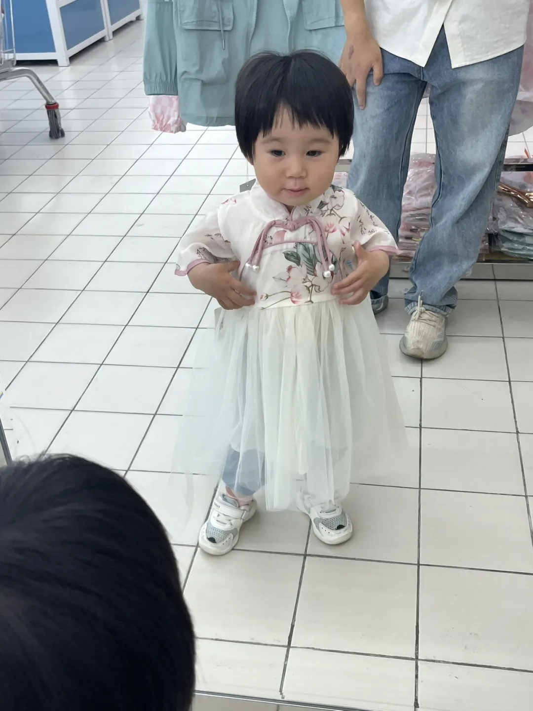
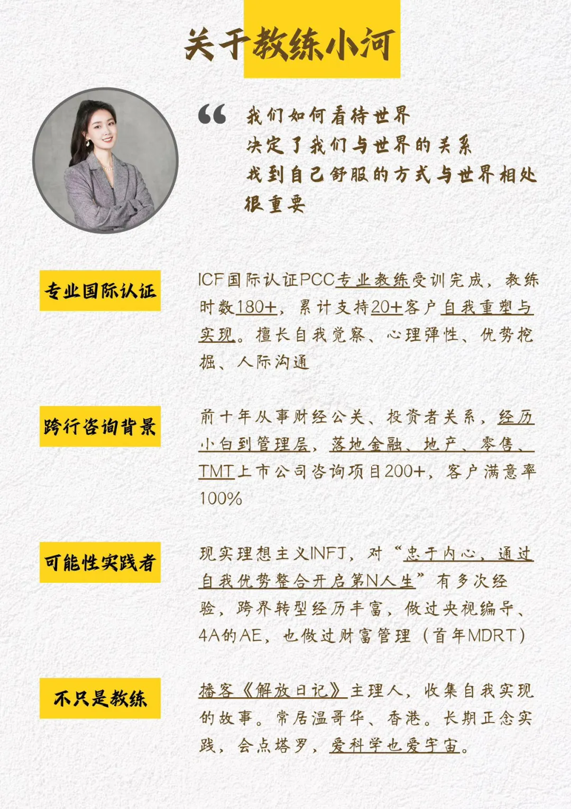
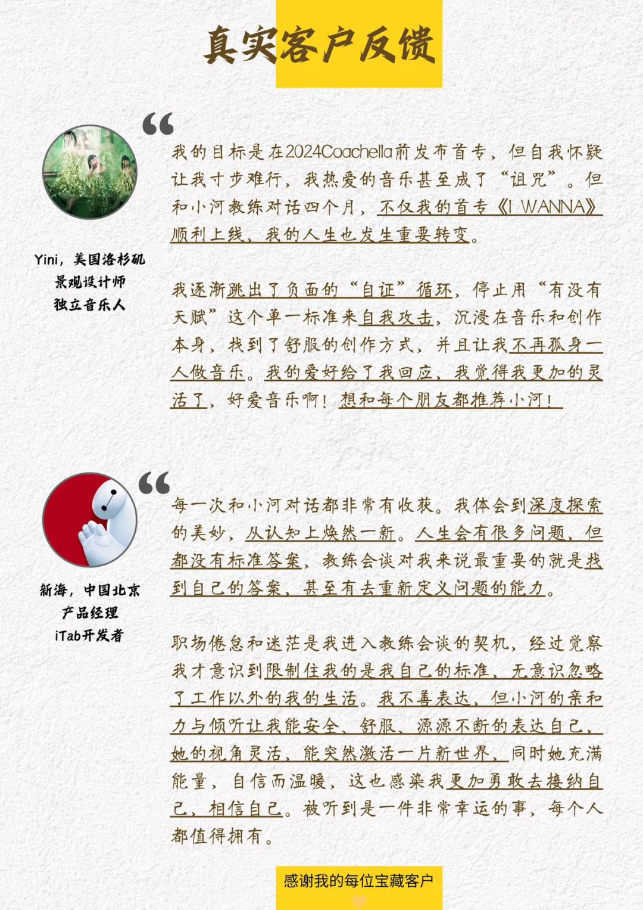

## **01 写在前面** {#2ef6628b00a181cba481f7281ff48d17}

三年前，我在我的公众号里，写下了这样一段话：

> 世界越来越无序，那我们就更需要寻找到内心的秩序。

最近我刚刚搬完家，搬离了我三年前住的地方，最近在整理收拾家里的各个物品时，秩序这个词，反复从内心中蹦出。

现在，我忙完手中所有的事情，静下来，开始认真思考，秩序到底是什么？我到底想要什么样的秩序？我到底想要过什么样的生活？

## **02 什么是秩序？** {#2ef6628b00a1815b8fe5d656da81f2f6}

百科上的解释是：

**有**[**条理**](https://baike.baidu.com/item/%E6%9D%A1%E7%90%86/2755696?fromModule=lemma_inlink)**地、有组织地安排各构成部分以求达到正常的运转或良好的外观的状态。**

在社会道路上，因为行人遵守交通法规，红灯停，绿灯行，使得道路通畅，交通井然有序。

在房间中，如果我经常打扫整理，房间干净，我就会心情舒畅。

在日常工作生活中，如果我能列好目标和专注做事，一件件达成，我就不至于混乱，迷茫，无所事事。

以上，我发现，社会需要秩序，我个人，内心更需要秩序，让自己从混乱之中，平静下来，知道自己过往的来处，更能感受当下自己的状态，还能对未来的自己保持期望，这也是我一直所追寻的宁静幸福时刻。

## **03 我想要什么样的秩序？** {#2ef6628b00a1815881b1f120c9342411}

1. **个人生活的秩序**：

我希望我的生活有规律，可以对自己有更多的掌控力。

	1. 按时起居。
	2. 健康饮食。
	3. 保持运动且有活力。
	4. 保持自己的生活空间的干净，整洁，舒心。
	5. 持续去做那些令自己愉悦的小事。

**2.个人成长的秩序**：

我希望在个人成长的路上，能持之以恒，不再是三分钟的热度，有广度的涉猎，更需要持续地深度。

	1. 保持对这个世界的好奇心，人，物，景。
	2. 保持开放的心态，多些向他人学习的谦逊，让自己少些偏见，
	3. 持续保持对自己感兴趣的方向的深入学习。
	4. 减少自己对手机，对新闻资讯的沉迷，用订阅，搜索来代替推荐信息流。

**3.人际关系的秩序：**

我希望我与家人，朋友，同事关系……，能轻松融洽。

	1. **沟通**：能清晰地表达自己的感受和需求，同时也倾听他人的观点。
	2. **尊重**：尊重他人的观点、感受和界限
	3. **信任**：建立和维护信任，遵守承诺和保密。
	4. **界限**：明确个人界限，并尊重他人的界限。
	5. **平衡**：在给予和接受、倾听和说话、独立和依赖之间找到平衡。
	6. **共情**：尝试理解他人的感受和立场
	7. **支持**：在他人需要时提供支持，无论是情感上的还是实际行动上的。
	8. **成长**：鼓励他人和自己共同成长，包括学习新事物和适应变化。
	9. **感恩**：对他人的好意和帮助表示感激
	10. **质量时间**：花时间与重要的人在一起，共享经历和创造回忆。
	11. **灵活性**：人际关系中需要一定的灵活性，以适应不断变化的情况和需求。
	12. **责任**：对自己的行为和关系中的问题承担责任。
	13. **礼物：**用心准备礼物。
	14. **解决冲突**：学会以建设性的方式解决冲突，避免逃避或加剧问题。

**4.工作事业的秩序：**

我希望我清楚自己的职业路径规划，自己想要做的事是什么，专注去做。

- **目标设定**：
	- 明确你的职业目标和期望。
	- 设定短期和长期目标，并制定实现它们的计划。
- **时间管理**：
	- 优先处理最重要的任务。
	- 使用时间管理工具，如日历、待办事项列表和时间跟踪应用。
- **组织**：
	- 保持工作空间整洁有序。
	- 合理归档文件和资料，便于查找。
- **专注**：
	- 减少干扰，比如关闭不必要的通知。
	- 练习专注技巧，如番茄工作法。
- **技能提升**：
	- 持续学习新技能和知识。
	- 参加培训和研讨会，以提高专业能力。
- **团队合作**：
	- 与同事建立良好的沟通和协作关系。
	- 分享信息和资源，共同解决问题。
- **工作与生活平衡**：
	- 确保工作和个人生活之间有健康的平衡。
	- 合理安排休息和娱乐时间，避免过度工作。
- **适应变化**：
	- 对市场和技术变化保持敏感。
	- 灵活调整策略以适应新情况。
- **反馈和评估**：
	- 定期评估工作表现和职业发展。
	- 寻求并接受同事和上级的反馈。
- **自我激励**：
	- 找到激励自己的方法，比如设定奖励。
	- 保持积极态度，面对挑战时不气馁。

今天是12月1日，12月的初始，2024年最后的一个月，我也希望自己能按照上面规划的框架去践行，去修正，用一个月时间去调整自己，以此来迎接一个全新的2025。

那么我后续的周记，也将会按照好好生活，好好工作，个人成长以及人际关系这4个方面展开。

## **04 好好生活** {#2ef6628b00a181e7acd1df88707ced24}

1.一首歌

2.

社会有各种法律法规，制度条约来维持它的秩序，那么我，也需要有自己维持秩序的“个人宪法”。

## **01 写在前面** {#2ef6628b00a1814ea90ff855f470d032}

Hi，朋友，你好哦。

欢迎你来阅读我的第37期周记。

**02 上周最爱歌曲推荐**

**《诺言》**

**诺言 (郭有才版)** ,郭有才

> 我不明白这世界为什么

	会让我感到那么多伤悲

	我不知道相爱的两个人

	留不住一个褪色的诺言

	我不了解沧海桑田

	能将一切相信的事改变

	我不相信付出过的真心

	要收回就能收回

	……

	人在雨里

	人在爱的岁月里漂流

	你我不能重头

	不能停留

	不能抗拒命运左右

	……

本周看到很多人发郭有才的《诺言》，听完后，觉得歌词写的很好，他也唱出了岁月的痕迹，但再看看他的直播间，只觉得这个社会有些魔幻。

**03 上周拍的最喜欢的照片**

> 上周天给小侄女买裙子时，她在镜子前看自己，看到新裙子后，露出了开心的笑容，那一刻真好。

## **04 上周感悟最深的一句话** {#2ef6628b00a181099d39e2759e53f48d}

> 认识自己的局限性，每一个人的想法都不同

我们每个人都是独立的个体，拥有独特的思维方式和认知模式。

这种认知模式不仅是通过我们的个人经历和教育背景所塑造的，还会受到社会环境、文化背景以及个人偏好等因素的影响。

正因为如此，我们在面对问题和思考事物的时候，往往会忽视一些其他可能性，只是局限在自己的认知框架里。

周天和小河教练沟通时，才意识到这个点。

我内心所想的，别人可能并不是这样想的，不妨先去问问别人怎么想，而别一直困在自己的思维里。

**05 上周喜欢的视频**

**1.《2024高考》**

，时长02:53

- [ ] 

**感悟：**距离高考还有最后的11天，微软团队做了这个AI 高考视频，很感动。

**2.《第八个秀》**

**感悟：**《THE 8 SHOW》讲述8名参与者被困在一栋分为8层的神秘空间，而“时间就是金钱”！在这里待得时间越久，就能赚越多的钱。

为了赚取在现实世界绝对不可能获得的天价数目，8人开始了累积时间的危险游戏，而神秘建筑内无处不在的监控摄像头，24小时实况转播。

这个剧仿真了我们当下社会的现状和阶层关系，非常现实。

**06 上周新经历**

**1.微软必应高考项目上线**

**感悟：**这次iTab 与微软团队的合作，感受出微软团队的特别用心，相信一定会帮助到更多用户，特别感谢他们给iTab在Edge 的推荐。

**2.与小河教练的对话**

**感悟：**每次跟小河教练的沟通都收获特别多，周天跟小河教练沟通时，发现倾听和沟通特别重要，我以前做的不太好，与自己相处和与家人，朋友相处，是有很多不一样的地方的，不要太执着于己见。

特别谢谢小河教练的引导。

如果你对你的人生之路有疑惑的地方，也欢迎去跟小河教练聊聊，会受益匪浅。

**07 下周期待的点**

**上周所期待的点**

---

1.工作上，学习更多优秀的产品的设计思路ing

---

2.

参与助力好朋友Jie的微软高考项目✅

---

3.继续列出自己 2024 年夏天心愿清单ing

---

4.欢乐谷水世界开馆一日游❌（下雨未去成）

---

##  {#2ef6628b00a181a49ff6d309df12b8b1}

**本周所期待的点**

---

1.工作上，学习更多优秀的产品的设计思路，产品上架字节平台

---

2.规划我的端午之行

---

3.思考产品的新的增长方案

---

4.每天要花至少半小时时间去学习新东西

5.每天要至少运动10min

---

**08 写在最后**

上周脑海里一直有个词在我脑海里闪现-倦怠感。

最近的感受是预期的管理，加之一旦太累了后，就会陷入这种感受。

我要做的就是多对未来抱有希望，常常践行我的心愿清单，多一些好奇心，多去运动，学习和行动。

**想到做到，得到世界的反馈，然后持续！**

我们，下周见。

2024/5/27午

北京

The End.

From 新海

