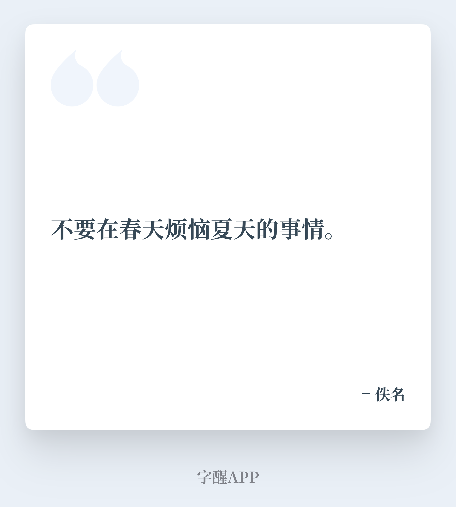
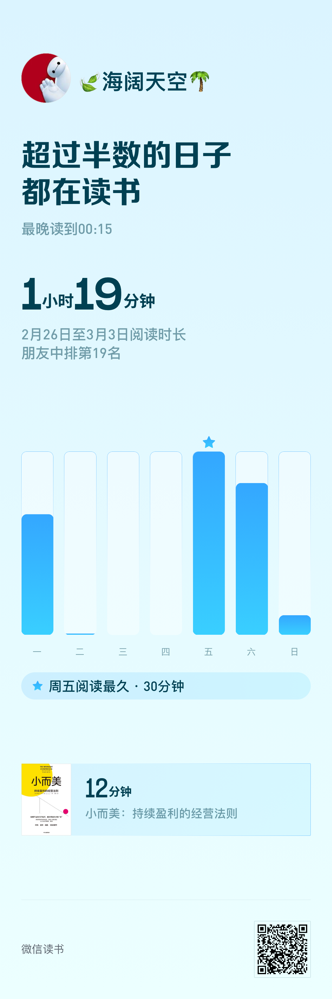
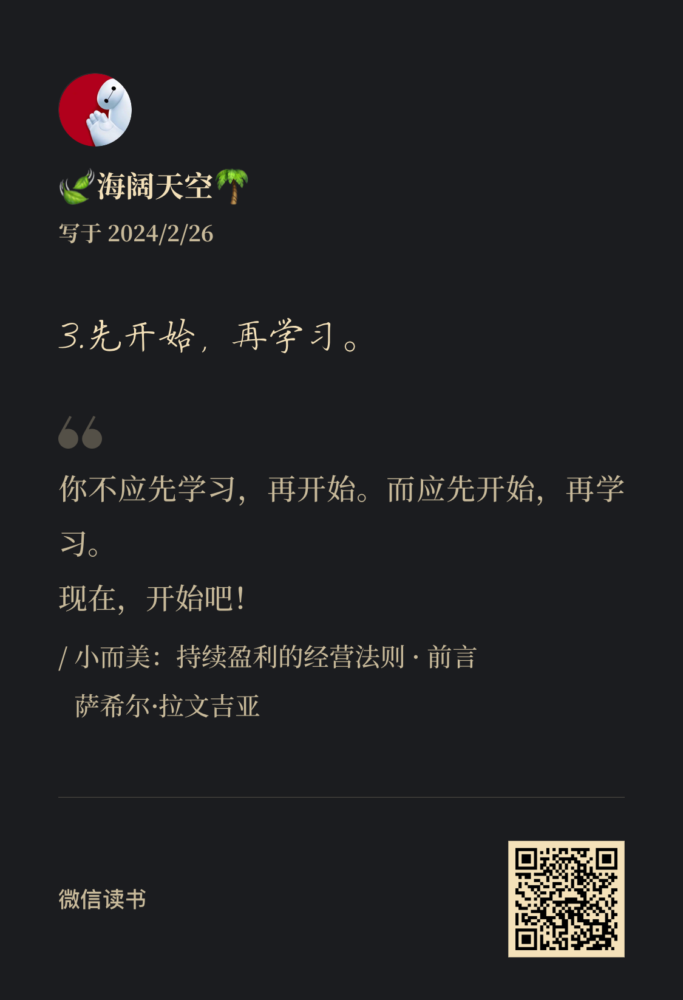
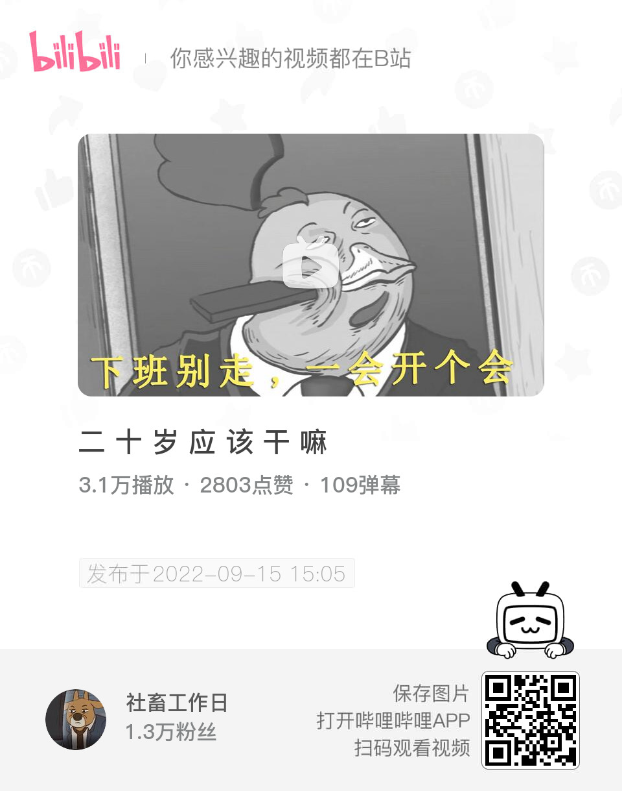
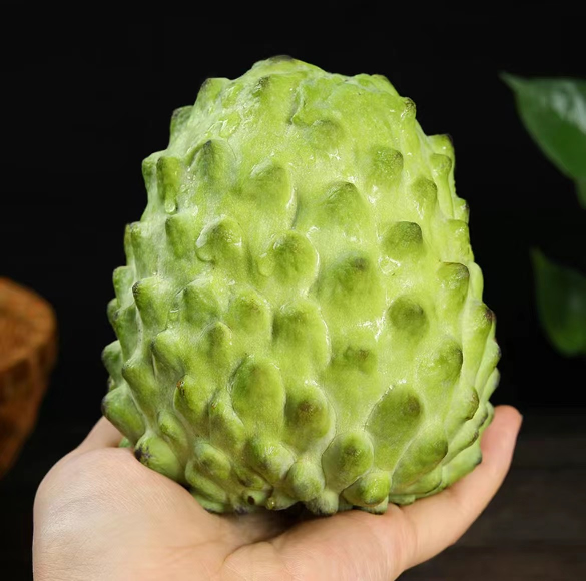
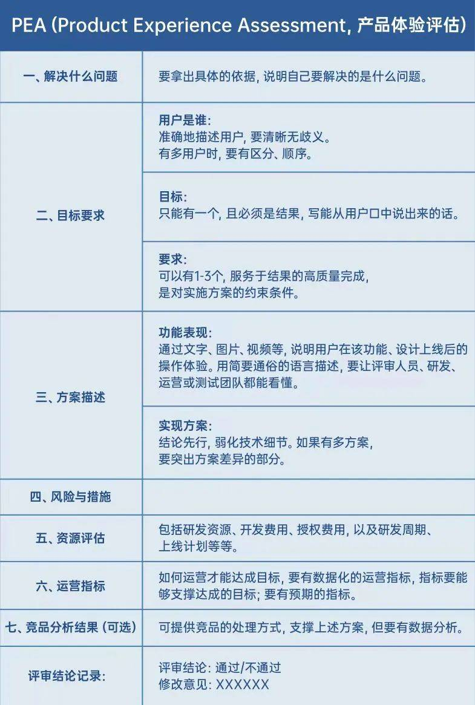
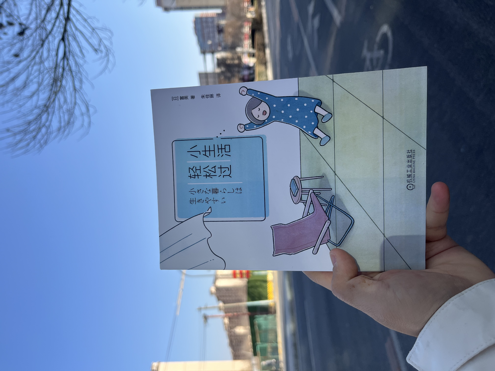
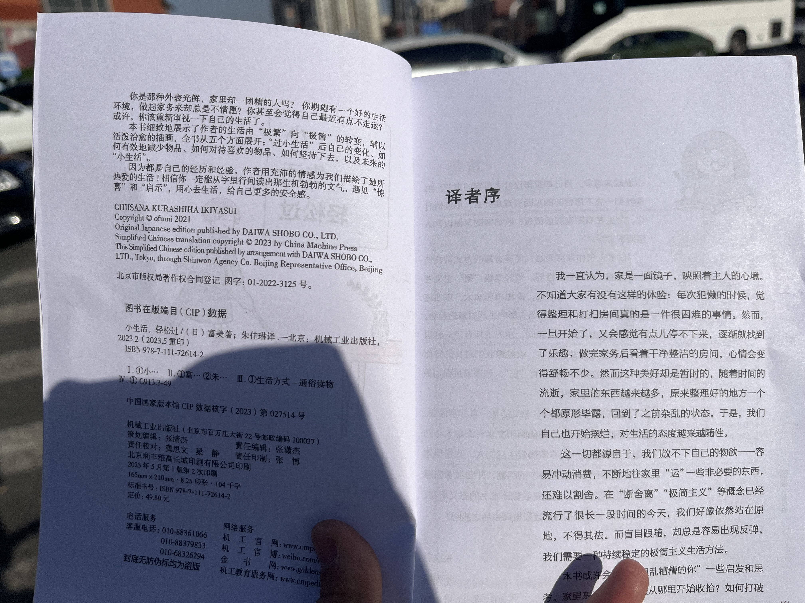

### **01 写在前面** {#2ef6628b00a181d99d46f120c14a138c}

Hi，朋友，你好哦。

时隔许久，好久不见呀！

记得上一期【新海周记】停留在2022年1月3日的第21期，已经记不太清是什么原因停刊的，但最近看到一些朋友的记录，于是我决定在这个春天，3月的第一周再重启我的周记。

记录心中所想，让时间留痕。

### **02 本周最爱歌曲推荐** {#2ef6628b00a181568f18fc9195596519}

《**问你十个问题**》：

[https://music.163.com/song?id=1410804786&userid=278428827](https://music.163.com/song?id=2011333627&userid=278428827)

你飞得高不高

你飞得累不累

把问题都给你

你全都会不会

每个岔路口

**选择都对不对**

……

> 这周下班路上，耳机里随机播放到了这首歌。歌词里面有句话是这样唱的“成长的过程像疾风追着小鸟”，他说的很对，就像《阿飞正传》里那句台词，“听说世界上有一种鸟是没有脚的，他只能一直飞，累了就在风里睡觉，这种鸟一生只能下地一次，那便是它死亡的时候。”我多么像疾风中的那只小鸟，匆匆茫茫，在路上见识世界，在途中认清自己。

### **03 本周一图** {#2ef6628b00a1813eb7cdc35d9133b23c}

> 这周在朝阳大悦城里看到了这句话，很可爱，当我们开始热爱生活时，探索生活，它总是充满惊喜。

### **04 本周最喜欢的一句话** {#2ef6628b00a181db8ee0e43096ca62fd}

> 本周在字醒app上，看到这句话，很是喜欢。春天来了，就应该多去想想春天当下应该做的事情，而不是遗憾过去，焦虑未来。

### **04 本周读到** {#2ef6628b00a18152b677cecd7db8dbcf}

不管何时，我觉得都应该多阅读，于是我又捡起了微信读书，空了就去上面阅读一会，慢慢来。

本周我很喜欢的一个阅读场景时，在地铁里带上耳机，找到微信读书上面自己特别关注的公众号，阅读他们最新新的文章。

**1.一些文章**

[https://mp.weixin.qq.com/s/38XbrqksXT5Ezv55-ojs-w](https://mp.weixin.qq.com/s/38XbrqksXT5Ezv55-ojs-w)

[https://mp.weixin.qq.com/s/uZPTa-pKKz0LF1VCSHI6AQ](https://mp.weixin.qq.com/s/uZPTa-pKKz0LF1VCSHI6AQ)

**2.《小而美》**

**04 本周看到**

过去的一周我也看到了很多有趣的视频，在这里整理分享。

**1.『 20岁应该干什么』**

> 本周无意间在B站看到up主【社畜工作日】做的三集社畜短片，写出了我们打工社畜的心声，拍手叫好。

**2.『数字人』**

> 本周六数字人刷屏，无意间在B站看到up主【社畜工作日】做的三集社畜短片，写出了我们打工社畜的心声，拍手叫好。

**3 『周处除三害』**

### **04 本周新经历** {#2ef6628b00a181848be5c88ab235783d}

新开此话题是因为我觉得人生每一个第一次的体验都值得记录。

**1 人生第一次吃释迦果**

本周末在我姐那边第一次吃**释迦果**，很甜，很细腻。

**2 地平线5**

本周Xbox 手柄到了，用它来开地平线5 ，不一样的体验。

### **06 本周新感想** {#2ef6628b00a18182abc1d3e99bd96ba0}

**1.我们时常需要“清理”，通过休息，清理我们的大脑，通过清理家务，让生活开始有序，通过清理待办，让我们知道什么事情优先级最高。**

**2.很多事情，我们都想要时，大概率什么都得不到，还是需要更加专注一些，一步一步来。**

**3.动起来是对抗无聊的最好方式。**

### **07 本周新收获** {#2ef6628b00a181928edae198e9202bb6}

**1.PEA产品文档**

本周看到李想总结的PEA 产品体验评估文档框架，很受用。

**2.把家里都清理一遍**

按照《小生活，轻松过》里面的建议，利用这个周末，把家里里里外外都整理清洗了一遍，清理完毕后，心情确实愉悦了很多。

- 

**08 下周需改善和期待的点**

**希望下周能改善的点：**

- 1.早上自然醒后，就立即起床，做一些自己喜欢的事情。
- 2.希望工作时用手环上的番茄时钟，提高效率，晚上少加班。
- 3.多行动，少犹豫。

**下周有所期待的点：**

- 1.春天来了，多出去走走，感受季节的轮换变化，很期待去奥森再跑一个龙🐉。
- 2.学完李想的产品课，总结出对我做产品有价值的点。
- 3.希望在工作上有一些突破吧！

## **09 写在最后** {#2ef6628b00a18119b9c7d6b2312d5ff9}

其实这周翻到2年前写的『北京春天之旅愿望清单』，被我当时的状态吸引并很感动。

23年下半年，我经历了很多事情，工作和生活上都有很多苦恼，自己的状态也不是特别好，渐渐地对很多事情都丧失了好奇心，浑浑噩噩，只觉得很累。

这周是2024年3月的第一周，北京的天气也开始回暖，我也想找回我当时的状态，对未来充满期待并一步步向前走。

前方的路依旧未知，但我可以去做一些自己想做的事情。

春天我来了！

最后，再次感谢朋友你的阅读。

我们，下周见。

2024/3/03 夜

北京

The End.

From 新海

