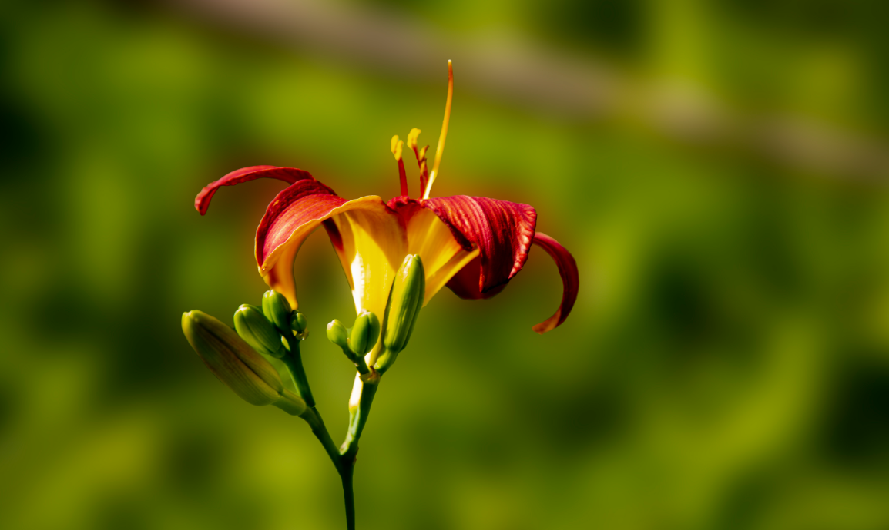
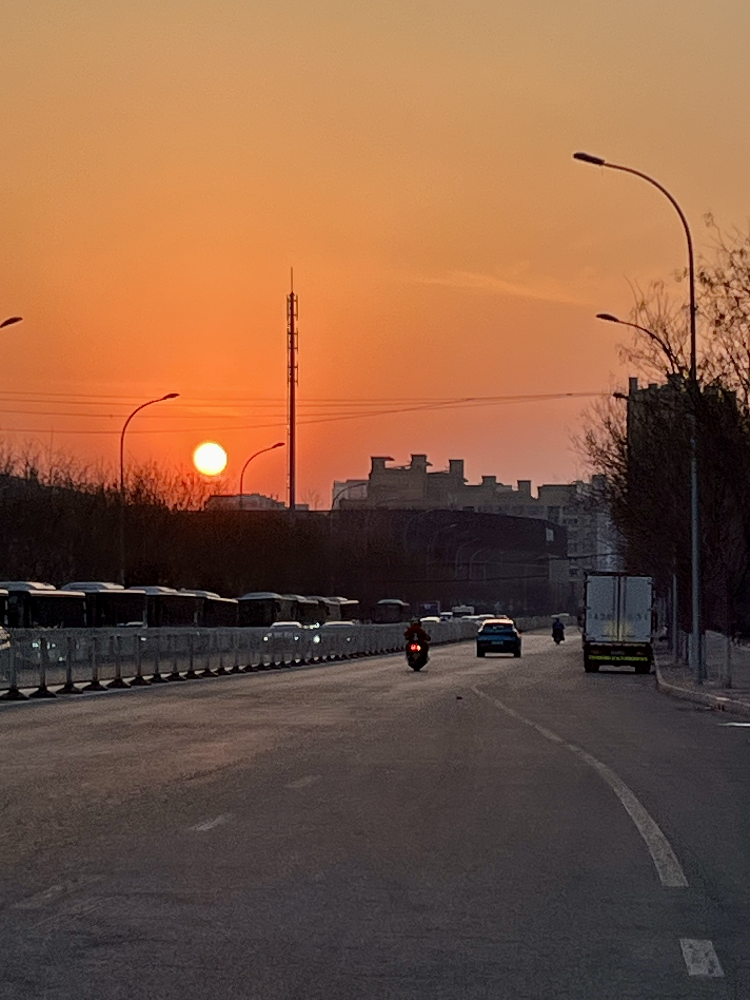
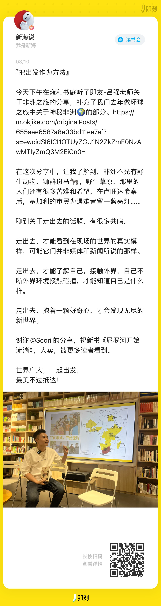
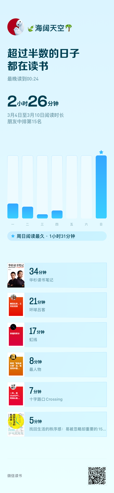
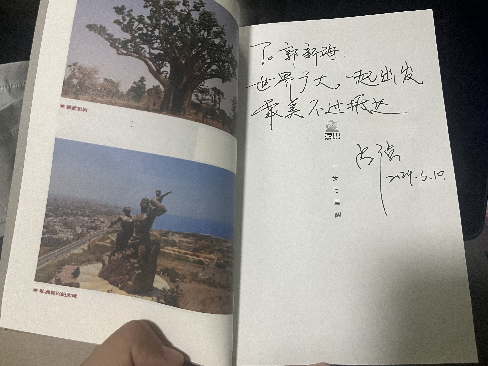
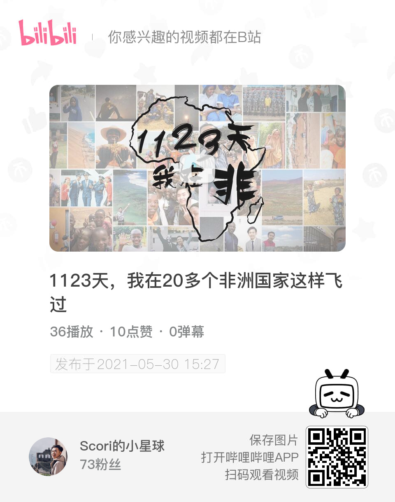
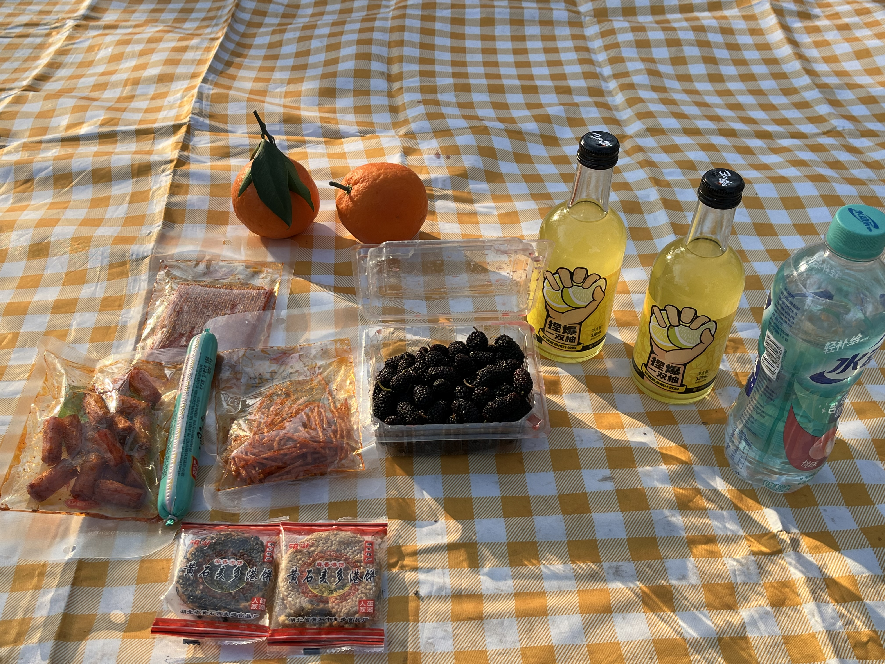
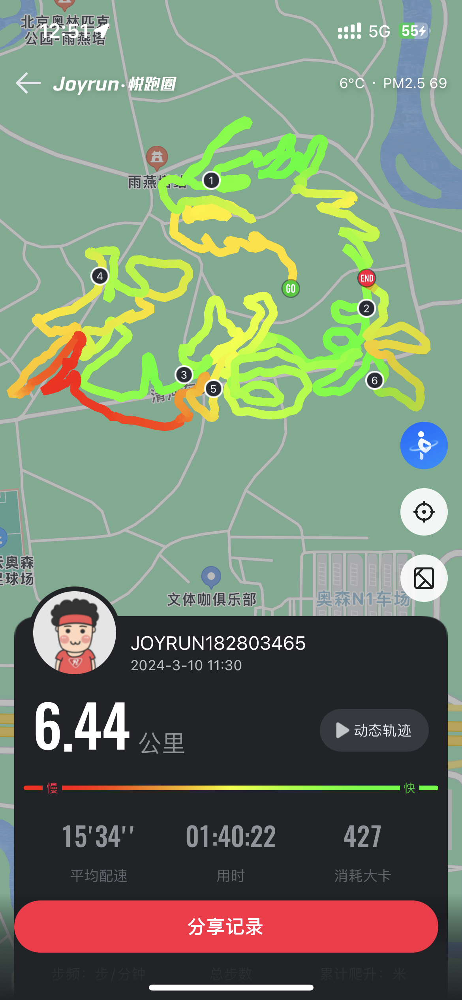
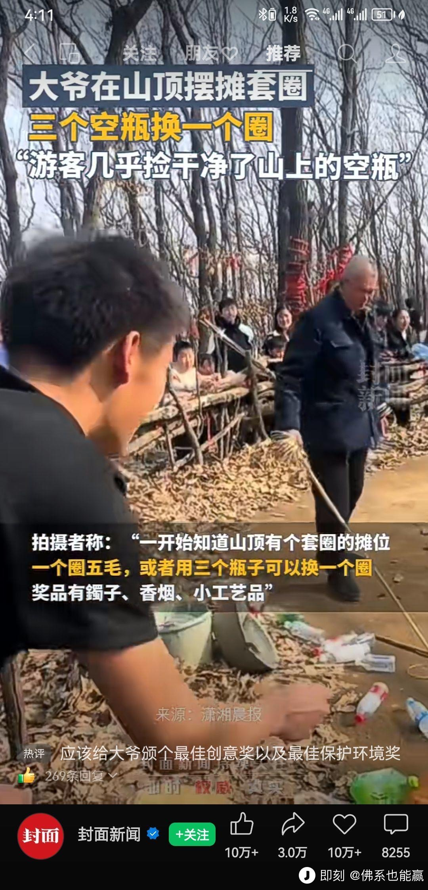

## **01 写在前面** {#2ef6628b00a181818463e9d3af0228a6}

Hi，朋友，你好哦。

时隔一周，我们又见面啦！

自从上周开始有意识开始去计划和记录后，我发现我内心的状态有一些改善了。

本周北京的天气经历几天的倒春寒后，后面几天逐渐转暖，开始有了一些春天的感觉，就好像我最近内心的状态的转变，寒冬会过去，冰雪会消融，乌云会飘散，阳光终会到来，春天真的来了！

## **02 本周最爱歌曲推荐** {#2ef6628b00a1817daf60e494a1e73f50}

**《萱草花 (live)》**

> [https://music.163.com/song?id=2108827923&userid=278428827](https://music.163.com/song?id=2108827923&userid=278428827)

如果有一天

心事去了远方

摘朵花瓣做翅膀 迎着风飞扬

如果有一天

懂了忧伤

想着它 就会有 好梦一场

遥遥的天之涯 萱草花开放

……

> 这周在星河湾公园里散步时，耳机突然想起了这首歌，旋律很悠扬，让我想到了小时候在田间无忧无虑的日子，后来，我百度了下，萱草花也被称为“忘忧草”，在《诗经》等古代文献中，就有提到萱草花能够让人忘却烦恼，带来快乐，就像这首歌也一样，听完后，也会让人感受到宁静的快乐。

## **03 本周拍的最喜欢的一张图** {#2ef6628b00a181babe35da134c46454b}

> 这张图是周六从星河湾公园回家时，路上正对着夕阳落山的方向，平时下班很晚，几乎很少看到夕阳，而在昨天我骑车一路追着夕阳，放了一首《落日大道》，追了我这个春天第一场完整落日，红彤彤的夕阳🌇，无限治愈。

## **04 本周最喜欢的一句话** {#2ef6628b00a181699e2af76f1331b63b}

> “把出发作为方法”

## **05 本周读到** {#2ef6628b00a1811d9fbed76aaa79f75b}

最近这周完整看书的时间不是很多，主要是在微信读书上阅读一些文章，不过发现也要比上周阅读时间多一会，下周继续保持，慢慢来。

**1.一些文章**

[https://mp.weixin.qq.com/s/iojU4z7aW1E7yaljHD9OeA](https://mp.weixin.qq.com/s/iojU4z7aW1E7yaljHD9OeA)

> 在3.8妇女节后，看到了这篇文章时，从她们身上我看到了生生不息的力量，生活苦难，但也不要忘记自己热爱的那些事情。

[https://mp.weixin.qq.com/s/STWL-ntH4Ew2M0FH1WY6Sg](https://mp.weixin.qq.com/s/STWL-ntH4Ew2M0FH1WY6Sg)

> 受Koji影响，希望我的周记也能持续下去。

[https://1q43.blog/post/5322#checkpoint](https://1q43.blog/post/5322#checkpoint)

> 很多时候我们对于幸福和苦难理解都是有偏差的，在不确定的时代，明白自己内心需要什么，什么是最初的快乐，尤其可贵。

**2.《尼罗河开始的地方》**

> 这周参加吕强老师的新书分享会，受到蛮多启发，关于“走出去”的理解又深刻了一些，找到共鸣的感觉真好，后面空了就读一读吕强老师的非洲之旅。

## **06 本周看到** {#2ef6628b00a18120934ed78afce4b5ec}

过去的一周我也看到了很多有趣的视频，在这里整理分享。

**1.『 早上挤地铁，中午点外卖，晚上刷手机，打工人如鲠在喉的一天』**

> 本周无意间在B站看到一席的最新分享，让明白了我在不知觉卷入了消费主义包围的世界之中，老师说的，即是我们很多打工人的现状。

**2.『Scori』**

> 这是吕强老师的B站账号，被他的环球旅行的Vlog 吸引。

**3 『关于一战的视频』**

> 讲述一战的战争历史，质量很高，睡前入睡视频。

## **07 本周新经历** {#2ef6628b00a181afa25be2764f376de1}

**1 今年春天的第一次露营**

本周六下午，看着外面天气很好，就拿出了陪伴我2年的露营垫子和小吊床，去超市买了一些吃的喝的，就去离家最近的星河湾公园开始了我今年春天的第一场露营。

走进公园时，阳光透过树干照在脸上，此时，耳机里刚刚想起了《萱草花》，就觉得此刻好美好

关掉手机，没有了工作消息的打扰，静静地享受下午的宁静时刻。

发现周围的人，好像也很松弛。

小孩在公园里嬉戏玩耍，小狗🐕也陪伴在主人身边，寻找新的朋友。

大人有的坐在湖边坐着晒着太阳，有的挥着杆钓鱼🎣，有的玩着飞盘🥏。

看着天，望着树🌲，静静呆了一下午。

**2 我的春天之旅02-去奥森走个“龙抬头”**

明天就是农历二月初二，跟着马拉马拉app上的活动组织方，一起去走出了一个“龙抬头”的图案，很有意思！

## **08 本周新感想** {#2ef6628b00a1814abe8fffe2da8ce9aa}

**1.动是解决焦虑的最好方法。
2.只有当自己失去的时候，才发现应该需要去珍惜。**

**3.工作和生活中都还有太多自己需要去学习的地方，一边做，一边学。**

**4.很多时候把奖励机制设置对了，很多难的事情也能事半功倍，如下面这位大爷👇**

## **09 本周新收获** {#2ef6628b00a1818fa9b0e33e9e37fdb4}

**1.李想做产品的方法论**

本周听完了李想关于做产品的方法论，佩服他思考和做事的方式，成功圈粉。

理想的成功，不是偶然，而是深刻对那部分用户群体需求的洞察，并利用产品力去解决，有启发。

下面这张图，还需要深刻理解，再此再贴一下。

**2.把家里都清理一遍02**

按照《小生活，轻松过》里面的建议，利用这个周末，把抽屉做了一场大扫除，分类好后，物品整齐归类的感觉很好，也给自己说，以后每天从家里出去时，尽量都带一些不需要的东西或垃圾扔掉。

## **10 下周需改善和期待的点** {#2ef6628b00a1811a979de5e4e53bf514}

**希望下周能改善的点：**

- 1.很多事情，其实可以提前去规划的，比如前一晚。
- 2.不要熬夜太久，尽量在12点之前入睡。

**下周所期待的点：**

上周所期待的三个点，我基本都有做到，的确，围绕期待去做事，会增加幸福感

- 1.春天来了，希望多出去走走，继续逛逛周围的公园，记录花骨朵开放的瞬间。
- 2.希望负责的产品在这个春天都有一些不错增长。
- 3.每天都要花时间去体验相关产品和新产品，多去看看那些优秀产品；

## **11 写在最后** {#2ef6628b00a181dc891dddee5377de10}

为了不让自己断更，其实后续的周记我都会在Notion 上记录。

一方面，有了新的灵感了就可以在Notion 手机端记录，

另一方面，我用**Notion Conveter** 插件，可以将Nontion 记录一键转换成公众号格式，也不必为每次排版而头疼许久。

当我开始阅读时，发现我并不孤独，我看到了很多人都有着类似的困惑，听不同故事，或许也有着不同可能性。

当我开始行动时，内心的困惑也开始渐渐少了一些，为了期待的愿望做事，并持续得到正反馈时，这种状态是我很向往的状态。

当我开始记录分享，让我感受到过往经历也可以留痕，用文字梳理，才能更好地面对未来！

**想到做到，得到世界的反馈，然后持续！**

最后，再次感谢朋友你的阅读。

我们，下周见。

2024/3/10 夜

北京

The End.

From 新海

