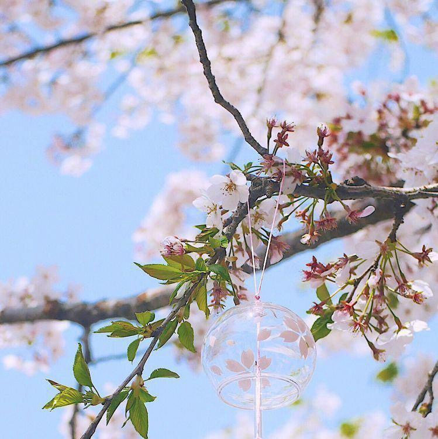
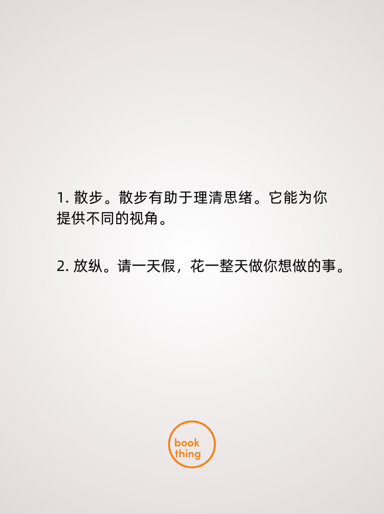
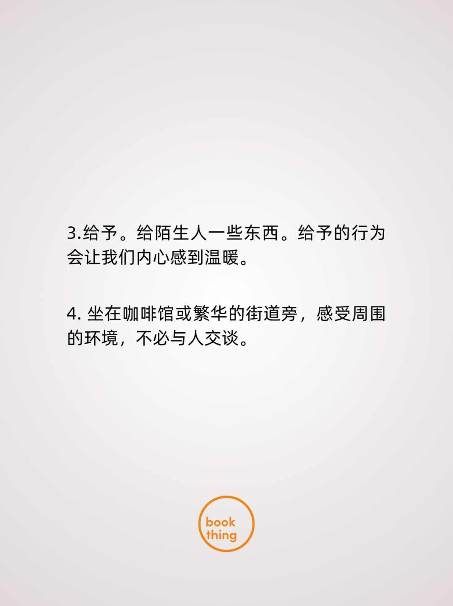
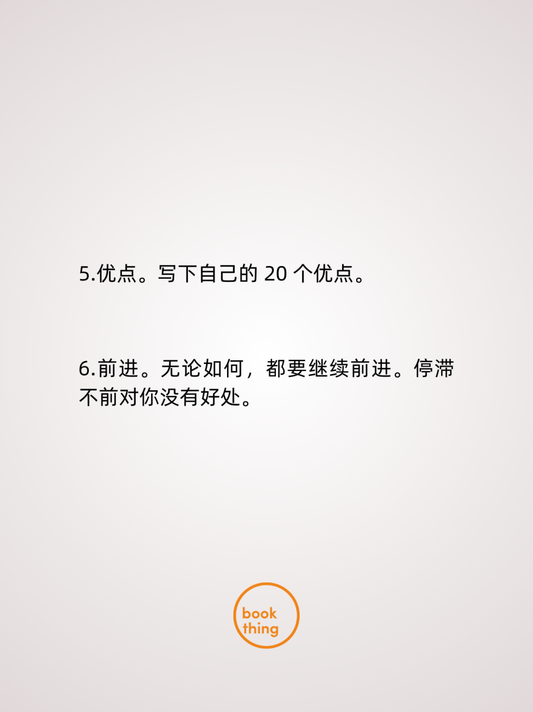
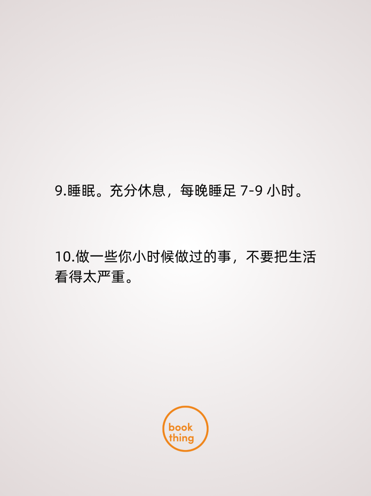
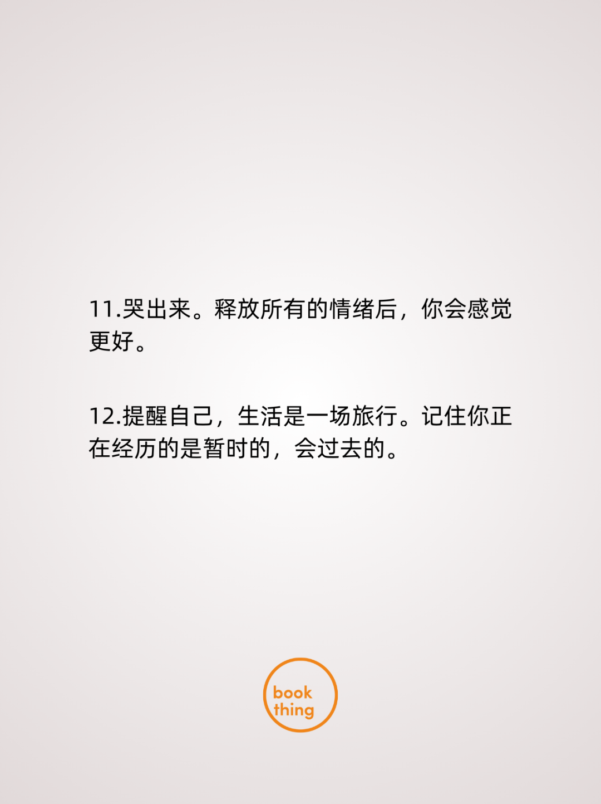

## **01 写在前面** {#2ef6628b00a181ee9c76ea2b896d3b05}

Hi，朋友，你好哦。

这一周我非常忙碌，很多原定的计划，因为突然新插入的事情而被影响打断。

但周记不能停，于是抽了一小时时间来梳理回顾过去的一周。

## **02 本周最爱歌曲推荐** {#2ef6628b00a1818381aac763b5c1f82d}

《『春』最适合春天听的歌》

> [http://163cn.tv/eMtm51](http://163cn.tv/eMtm51)

> 这周我收藏了一个《最适合春天听的歌单》，我觉得在春天有一件幸福的事。就是在暖阳下，戴着耳机，听着喜欢的歌，在公园散步，也把这个歌单分享给你，祝你春天快乐。

## **03 本周拍的最喜欢的一张图** {#2ef6628b00a1810bac50ef6c41a09522}

> 这周我在十里堡赏桃花时，有两位80多岁的爷爷奶奶也在旁边，爷爷当时正在拍花，奶奶在给这位爷爷指导，奶奶说近一点，再近一点，爷爷按照指导，咔嚓咔嚓，连拍好多张，爷爷拍完，奶奶凑近了看着相册，此时爷爷和奶奶都露出了像小孩子般的笑容。

	这一刻，我正在旁边看到，觉得真好啊！我想这就是执子携手，与子偕老，最美的老年爱情写照吧！

## **04 本周最喜欢的一句话** {#2ef6628b00a1817e934ccfb0267af77e}

> “减少切换，享受专注”

## **05 本周读到** {#2ef6628b00a181fb9c3df630e1222cf4}

最近这周太忙，基本没有怎么完整读书，无意间看到了这样一段话，给你分享。

## **06 本周新经历** {#2ef6628b00a1810abf41dfde4dcb767d}

**1 人生第一次看线下脱口秀**

人生第一次在线下看脱口秀，真的好开心。

这些脱口秀演员，用诙谐幽默的口吻去调侃我们日常生活，好有意思。

**2 我的春天之旅03-在十里堡看到了最美的山桃花盛开**

**3 我的春天之旅04-玉河公园里的春风十里**

## **07 本周新感想** {#2ef6628b00a181cbbd96ef26487e707b}

**1.专注做事，减少同一时间多线程切换；
2.记录是有意义的；**

## **08 本周新收获** {#2ef6628b00a1819caa69d52e5dcf1202}

**1.报名了北京，上海两场春天的半马**

**2.跟北京的w2solo 的独立开发者在红螺寺聚会**

## **9 下周需改善和期待的点** {#2ef6628b00a18102bb31f11d3ad0691c}

**希望下周能改善的点：**

- 1.恢复日常的运动，尤其是下班后多走走。
- 2.了解自己，对自己进行优劣势分析。

**下周所期待的点：**

- 1.北马和上马的中签结果。
- 2.与一些up 主合作，联合发一些产品视频；
- 3.学习更深入的产品数据分析，给产品优化调整提供思路；

## **10 写在最后** {#2ef6628b00a181e9888bdecf869d9eb1}

**想到做到，得到世界的反馈，然后持续！**

最后，再次感谢朋友你的阅读。

我们，下周见。

2024/3/17 夜

北京

The End.

From 新海

