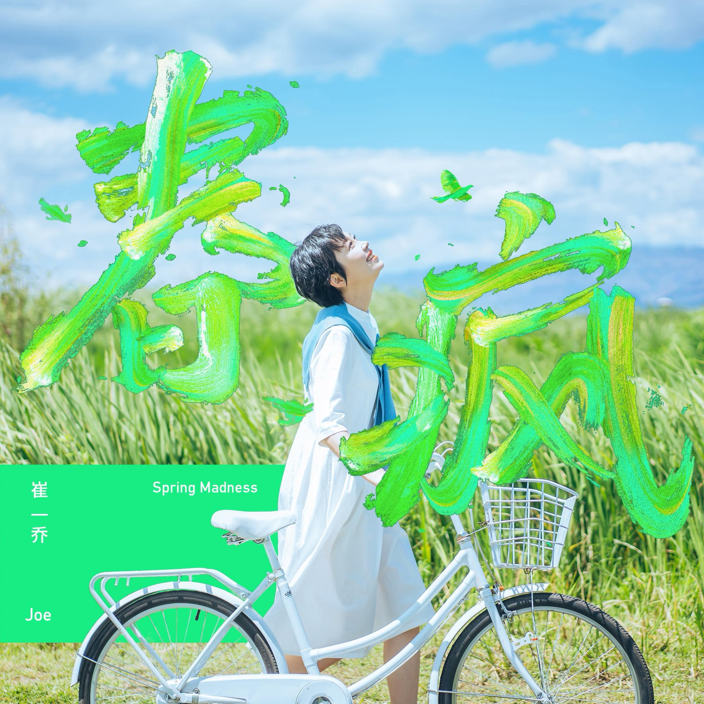
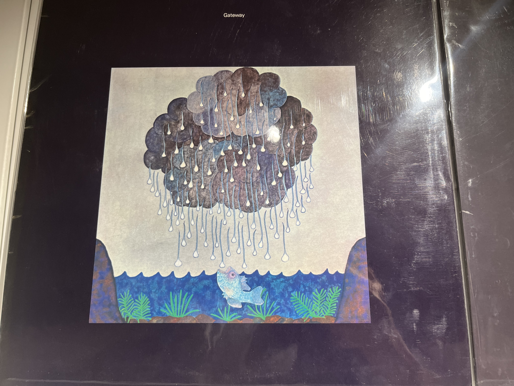
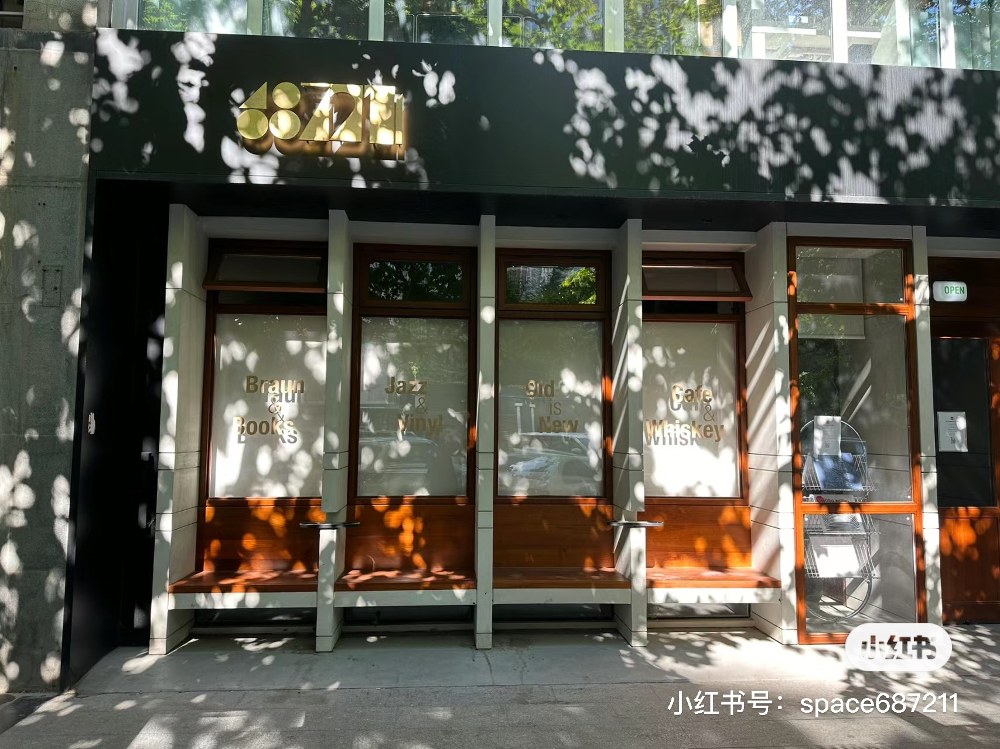
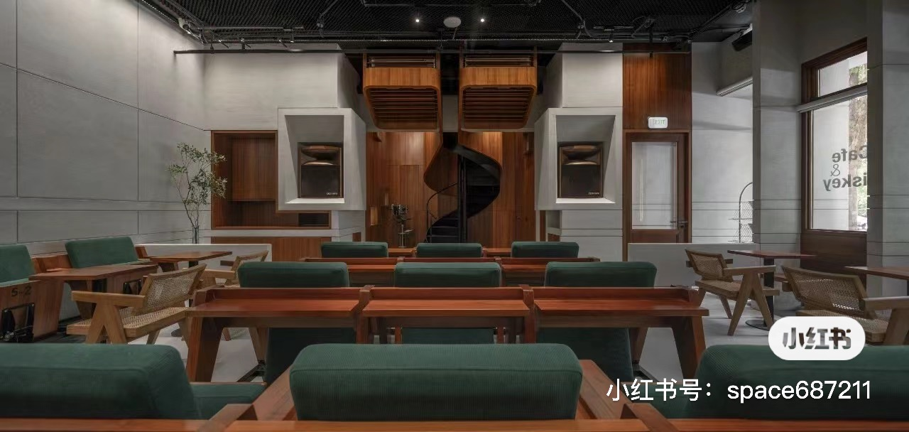
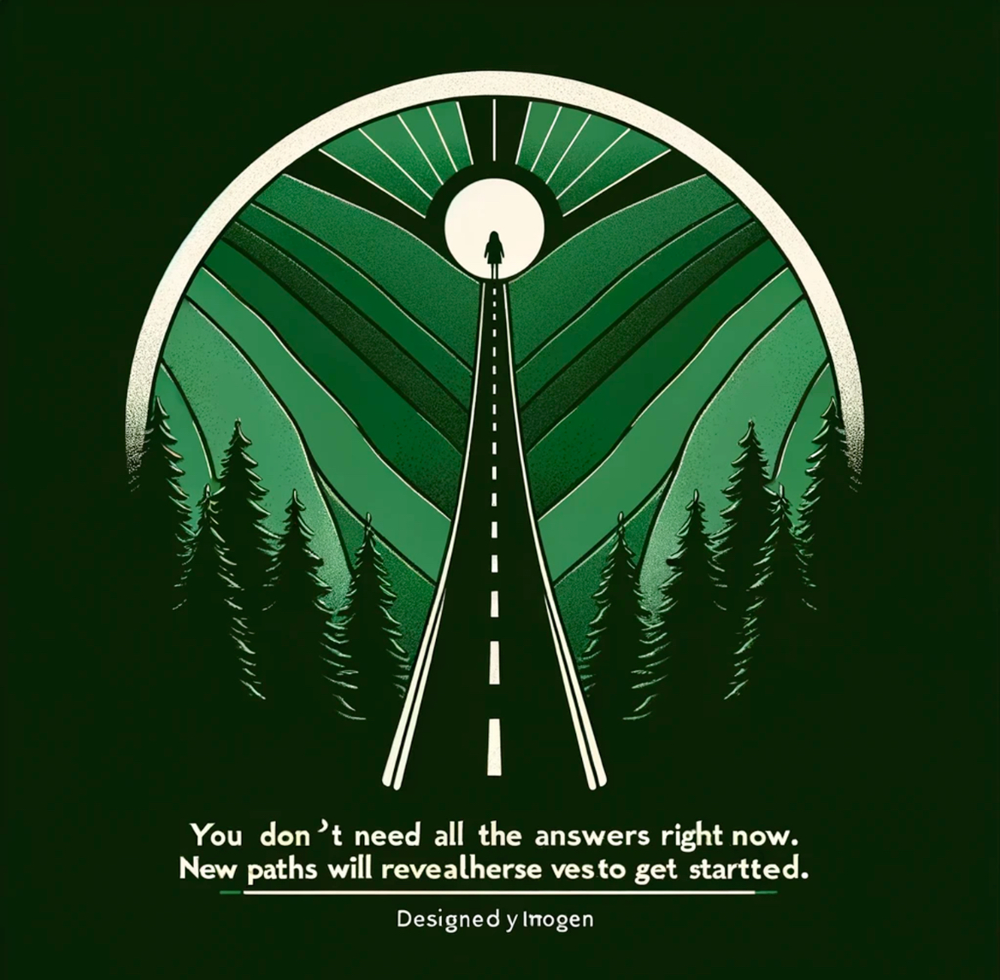
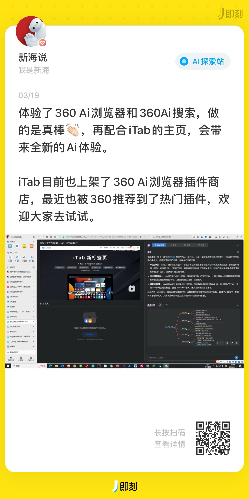
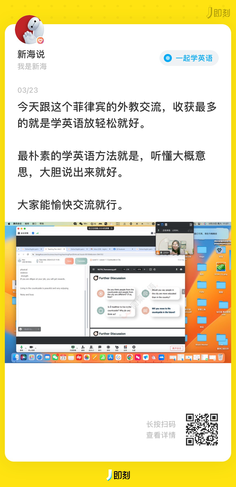

## **01 写在前面** {#2ef6628b00a181fb9bc8fbf2b916f222}

Hi，朋友，你好哦。

这一周北京的天气从晴天变成了雾霾天，甚至有些降温，还下了第一场春雨，天气的波动，自己内情绪也会随之而波动。

不过每当我打开notion记录时，回顾过去一周的经历，内心找到了一丝宁静。

## **02 本周最爱歌曲推荐** {#2ef6628b00a181b2afd3c2334da122db}

**《春疯》**

我想与你往前往后往南北往左往右

我想与你转个时空转到尽头转不够

好像在云中 跟画在周游 杂能够

我想与你穿山越岭浮光掠影半梦半醒

我想与你暖上这口满上这酒烂心头

大地在颤抖 是谁在嘶吼 跟我走

一时儿望着 一时儿亮着 一列列列列

一时儿抬头就看见天

一时儿唱着 一时儿浪着 一列列列列

这遥远的 遥远的 愿

我想与你乘风破浪

一起踏遍这人世沧桑

吻遍星星问遍月亮

哪里有光哪里徜徉

我想与你穿越时光

一起点燃这春树红装

吻遍朝阳吻遍风霜

哪里有香哪里昂扬

春天的爱来了

春天的梦来了

春天的希望春天的浪

春天的花衣裳

> [https://music.163.com/song?id=1833656040&userid=278428827](https://music.163.com/song?id=1833656040&userid=278428827)

> 这周随机听到这首我们陕西歌手的音乐，一方面我很喜欢这首歌的歌名-春疯，的确，春天就应该疯狂一下，好好去感受万物变化，一方面被歌手的三秦嗓音吸引。

## **03 本周拍的最喜欢的一张图** {#2ef6628b00a1815483f1f589df8a5f89}

> 这周天去了一位即友前辈开的爵士咖啡店Space687211，刚到门口，就被它门外的装修设计打动，当太阳出来时，在门口晒着太阳，我想一定很美好吧！相比门口，室内的设计更让我觉得这个店主很有品味，店里只有正在播放爵士的黑胶，每一个人都很安静地在聆听。在这家店，让我感受到，听音乐是见很美好的事，同时让我开始留意每一个音乐专辑封面，作者想表达的情绪。

> 在二楼唱片展览上，我看到一张唱片封面，一个鱼正在抬头喝天上的雨滴，我驻足看了许久，既然是鱼，原本河里的水已经足够它喝了，为什么还要抬起头喝来自天上的雨滴了？或许很多时候，我也像这只小鱼吧，在一个地方工作生活久了，总想抬头看看围城之外新鲜的事物。

## **04 本周最喜欢的一句话** {#2ef6628b00a1813088fcf37c860df698}

> _**遇事不决可问春风,春风**_**不语即随本心。**

> 一旦你开始行走，风景就会改变。你现在无需知道所有的答案。只要你有勇气开始，新的道路就会展现在你面前 。 -Szhans

> “不要想，要去看。不要问，去感受。”-Lightory

## **05 本周读到** {#2ef6628b00a1812a9118faf58871429f}

最近这周太忙，基本没有怎么完整读书，无意间看到了这样一段话，给你分享

### 1.阅读的文章 {#2ef6628b00a181f0ba8cd98cedcbc488}

1.《**这个简单的生活方式，为你带来满满的幸福感**》

[https://mp.weixin.qq.com/s/_NKPdUQ3fXY9rf-pFcfUyw](https://mp.weixin.qq.com/s/_NKPdUQ3fXY9rf-pFcfUyw)

**阅读感悟：**影响幸福感的最大因素是什么？会是财富、事业、理想、生活环境、社会地位，但除过这些外显的物质环境，我们的内心状态更是需要留意，**积极的社交反馈也是我们最基本的需求。**

按作者建议有四点，很受用：

1.打开自己，让自己处于开放状态,不要封闭自己。

2.**保持微笑。**

3.日行一善,**5分钟给予。**

4.找到让自己舒服的小团体，多利他，多分享。

**2.美团骑手转职指南**

[https://digua.moe/posts/20240311-meituan-rider.html](https://digua.moe/posts/20240311-meituan-rider.html)

**阅读感悟：**作者以程序员视角去跑美团外卖带来的社会观察和思考，很认同作者关于副业的思考：副业之所以具有竞争力，是因为它有一个「副产品优势」，就是说你在做主业的时候，会累积下来一些经验和知识，这些东西是无成本得到的，把它们加工成副产品，就会很有竞争力。

### 2.读的书 {#2ef6628b00a181f39147c15e988086e0}

**《体验引擎：游戏设计全景探秘 》**

这本书是最近参加数数读书会的必读图书，作为豆瓣评分高达 9.4 分的游戏行业必读神作**，**翻开《体验引擎：游戏设计全景探秘》,便能感受到作者对游戏深刻理解。

我作为游戏行业的从业者也是游戏爱好者，想通过这个本书更加系统化的认识游戏。游戏开发者和游戏玩家的视角是不同的，有时的确得跳出固有思维去看待它们，也想通过本书习得一些理论，结合工作实践，更好地融入到工作和游戏本身，换一个视角看待理解游戏。

第一章读书笔记：

## **06 本周看到的新视频** {#2ef6628b00a181b3a211e2a584b87822}

## **06 本周新经历** {#2ef6628b00a181f7a88cc2a5480c25e5}

**1 AI搜索会改变我后面的搜索习惯**

**2 人生第一次吃天水麻辣烫**

**3 带新加坡的同事逛潘家园，跟外教学英语**

## **07 本周新感想** {#2ef6628b00a181f3b72cf0dad7050268}

**1.工作上的事情很多，但不必每一件都都为此忧愁。
2.慢也好，步伐小也罢，是往前走就好。**

## **08 本周新收获** {#2ef6628b00a1817899fbe3cf65a7f808}

**1.最近早起早睡后，留给自己的时间多了一些，可以把它们投入到学英语和看书上面了。
2.心态很重要，还是需要自己观察自己，然后自己调节。**

## **9 下周需改善和期待的点** {#2ef6628b00a181018ff0e601ed50ed67}

| **上周期待的点**               | **期待结果**              |
| ------------------------ | --------------------- |
| 北马和上马的中签结果               | 均未中签，运气着实不太好          |
| 与一些up 主合作，联合发一些产品视频      | 本周会有iTab 的新视频发布       |
| 学习更深入的产品数据分析，给产品优化调整提供思路 | 分析需要有分析框架，然后从宏观到微观细化。 |

| **希望下周能改善的点**    |
| ---------------- |
| 1.多虚心请教老师，不要不懂装懂 |
| 2.定时上英语课         |
| 3.保持家里整洁         |

| **下周所期待的点**                           |
| ------------------------------------- |
| 1.规划清明旅行计划                            |
| 2.期待iTab 的新视频能被更多用户看到，能与国内更多优秀AI 厂商合作 |
| 3.去朝阳公园露营放风筝                          |

## **10 写在最后** {#2ef6628b00a18168a5f6dc7c69fcfc77}

这个世界人性很复杂，社会更是复杂，但还是有很多美好的事物，比如文字图书，风景照片，视频影视，游戏，外面的自然风景，不论何时，还是需要给自己留一些时间，把它们“浪费”到自己喜欢美化事物上。

**想到做到，得到世界的反馈，然后持续！**

最后，再次感谢朋友你的阅读。

我们，下周见。

2024/3/24 夜

北京

The End.

From 新海

