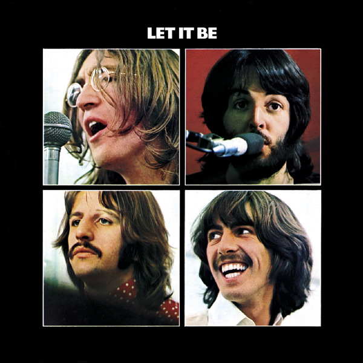
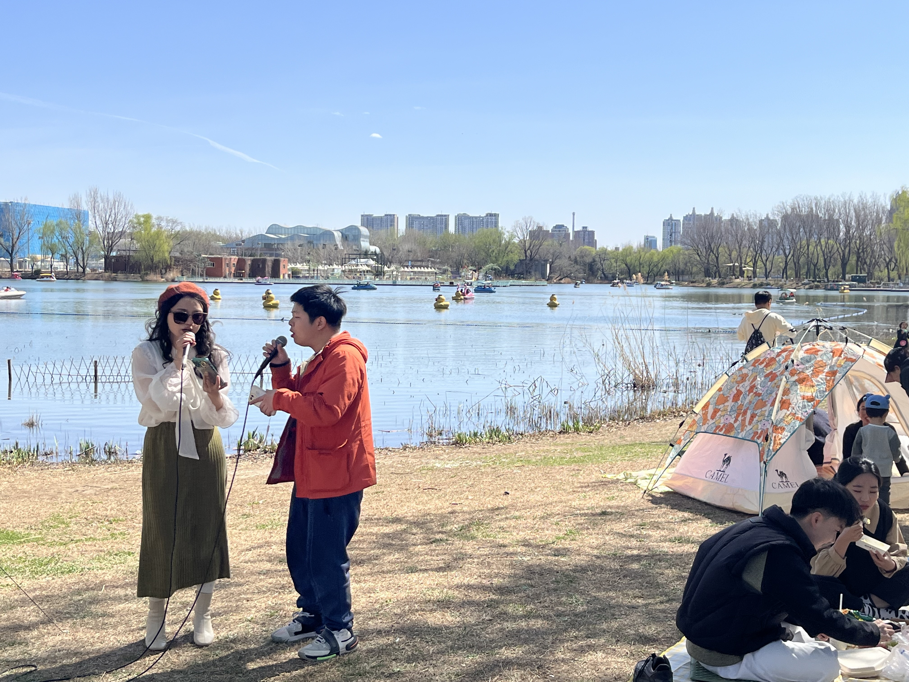
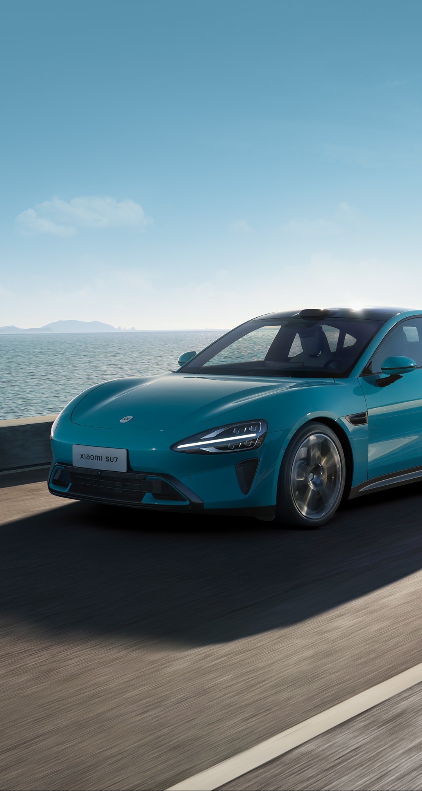
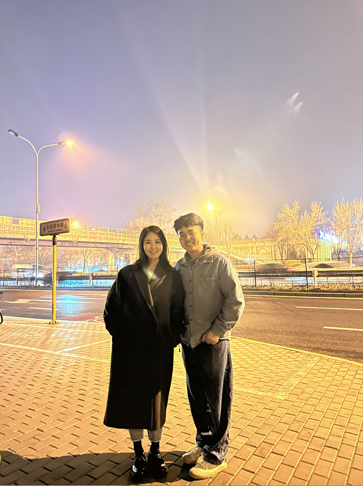
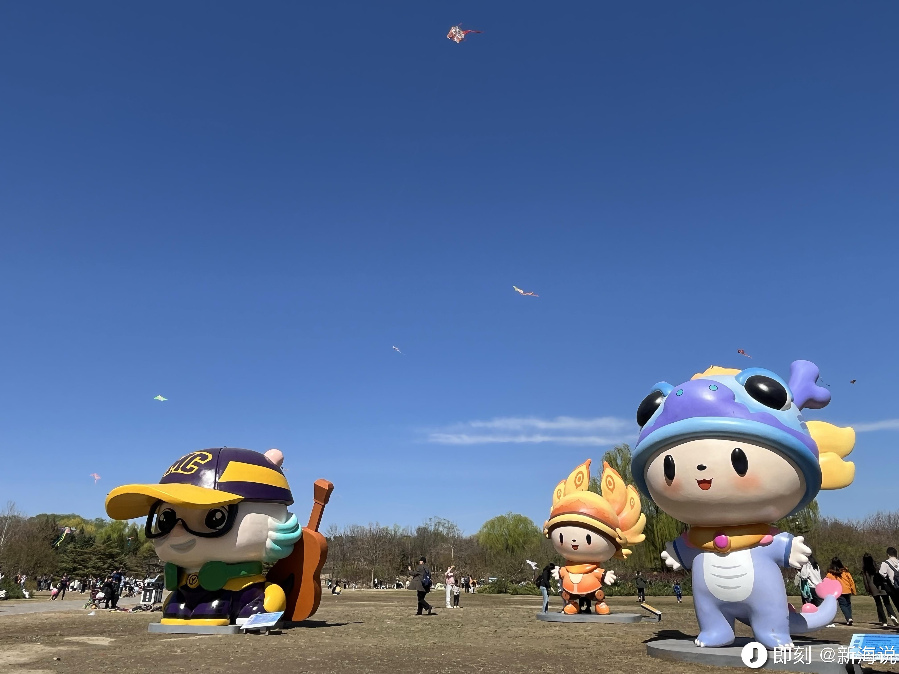

## **01 写在前面** {#2ef6628b00a181ddbe7dfad480607840}

Hi，朋友，你好哦。

这一周北京的天气伴随着春风从阴霾天中走出，周末的天气格外的好，于是周末两天我都在户外感受春天。

本周见了一些老朋友，认识了一些新朋友，跟他们聊聊天，大家的生活也是过得如此丰富有趣，

现在我来写下我的第 26 期周记，欢迎你的阅读。

## **02 本周最爱歌曲推荐** {#2ef6628b00a181b2a1e4e5fdf9ff2415}

**《Let It Be》**

When I find myself in times of trouble
Mother Mary comes to me
Speaking words of wisdom let it be
And in my hour of darkness
she is standing right in front of me
Speaking words of wisdom, let it be
Let it be, let it be
let it be, let it be
Whisper words of wisdom, let it be
And when the broken hearted people
living in the world agree
There will be an answer, let it be

> [https://y.qq.com/n/ryqq/songDetail/000wlcpf3DOBc2](https://y.qq.com/n/ryqq/songDetail/000wlcpf3DOBc2)

> 这首歌是本周我在听的那场《Live Aid》拯救生命演唱会时的最后一曲，了解到在40 多年前，全世界最杰出的音乐人聚在一起，通过歌声为了非洲筹款，就像歌词里所唱：

	所有伤心的人们
	生活在这个世界上
	都将会有一个答案 顺其自然
	即使他们被迫分离
	他们仍有机会相见
	都将会有一个答案 顺其自然

## **03 本周拍的最喜欢的一张图** {#2ef6628b00a181eeaf48ff3e1dc2ea65}

> 这周天和家人在朝阳公园里散步，风和日丽，走到湖边时，看到或许是一对情侣她们在湖边唱着英文歌，这种感觉真好。

## **04 本周最喜欢的一句话** {#2ef6628b00a181e0aee7fdc05fb54510}

> _**喜欢是第一生产力。**_

喜欢是第一生产力
只要喜欢，总会想做的更好。
想做的更好，就会更加专注投入，在做事的过程中体验到心流，

在做完事后，也或许会收到正向反馈，然后就会进入进入 positive feedback loop 

## **05 本周读到** {#2ef6628b00a181db9685ccf22fe9b2f3}

### 1.阅读的文章 {#2ef6628b00a1817cb6fbef7b7718dda2}

1.《**《资本主义个人反抗指南》阅读笔记**》

[https://digua.moe/posts/20201021-capita-personal-resistance-guide.html](https://digua.moe/posts/20201021-capita-personal-resistance-guide.html)

**阅读感悟：**消费主义社会下，如何正确处理人和钱的关系，这个话题值得深思。

很多时候的我们会不知觉间掉入消费主义陷阱，购买超过自己能力承受范围之外的商品，提前享受了商品，但之后却不得不去偿还更多债务，被债务压身转不过起来，你就不得不去不停工作，不停挣钱，最终失去自由。作者给的建议：

1.节流：买自己所需，买自己能力范围能承受的；

2.开源：投资自己，让自己升值，将自己提升的能力转化为能给别人带来更多价值的部分，挣得额外收入；

**2.《公园20分钟效应》**

[https://mp.weixin.qq.com/s/_ARHuROgM7O-wnO_rlyIAQ](https://mp.weixin.qq.com/s/_ARHuROgM7O-wnO_rlyIAQ)

**阅读感悟：**每天在户外待上一小段时间能够让人更加快乐。即便不做运动，只是到公园待上20分钟，也能让状态更好。

## **06 本周看到的新视频** {#2ef6628b00a1814695e2f4af9f208512}

**1.小米汽车发布会**

雷军是我偶像，看到他如此真诚地发布这款小米汽车，真心佩服！

**2.【人类群星闪耀】Live Aid 为什么成为了史上最伟大的演出？**

这部视频的内容主要基于纪录片《The Band Aid Story (2004)》，“LiveAid”全演出录像，以及Queen的电影《波西米亚狂想曲》，就像这个 up 主想表达的：

这场演出已经过去快40年了，早已不是热门话题，甚至恐怕已经处于被遗忘的边缘。无论是音乐，电影，人文，社会领域，我们都希望有更多的先驱引领我们往黄金时代走去。而我不确定今天，是否因为快消费和碎片化信息时代，我们快速在感兴趣和失去兴趣中切换，爽和痛苦中游离，越来越难看到慢工出细活、沉淀思考的人和事。

我们需要先驱，而先驱们却似乎正在消散，同时，人与人之间的隔阂反而在加深了，地区与地区之间互相仇恨，瘟疫出现，相互埋怨和所谓举报出现，局部战争重新出现。

希望我们可以区分开：人民是人民，国家是国家，ZF是ZF，他们之间是有互相影响，但也是相对独立的概念。

## **06 本周新经历** {#2ef6628b00a18112ade0da6d9ccaa930}

**1 与小河教练在北京面即**

小河教练从加拿大回到北京，周二与她和小陈相见，虽然这是我们第一次线下面即，但又像是相识很久的朋友，相见恨晚。

我的第一期播客，是在小河教练引导下打开的；

我最近的状态调整，也是在与小河教练的交流中一点改善，找到我到底在害怕什么？

我很认同小河教练说的做自己喜欢且觉的正确的事情，朝自己所期待的方向去大胆走就好，没有什么好怕的，总会有路。

当晚在北京见面后，我们聊了很多话题，第二天她们就离开了北京，期待以后再会！

**2 在朝阳公园春游，散步，晒太阳，放风筝**

**3 吃到了恩施三绝**

## **07 本周新收获** {#2ef6628b00a1817da26bc93865493a16}

**1.最近意识到做产品很重要，同时做用户增长更重要，上周试水如何在B 站上做投放，投出去第一支视频。
2.产品付费分析对比着看，会发现很多不一样的点；**

**3.虽然最近加班很多，但也逐渐能给自己的生活留一些时间，做一些想做的事情。**

**4.理发时认识了一位退休的国家干部，他的人生故事非常有趣，给我 40 年退休后的生活找到了锚点。**

## **08 下周需改善和期待的点** {#2ef6628b00a181208356f5be44095239}

| **上周所期待的点**                           | **期待结果**                                     |
| ------------------------------------- | -------------------------------------------- |
| 1.规划清明旅行计划                            | 清明准备去南方，开启爬黄山之旅                              |
| 2.期待iTab 的新视频能被更多用户看到，能与国内更多优秀AI 厂商合作 | 上周 iTab 的视频被 B 站，小红书里几十万人观看，同时也加快了与国内优秀的厂商合作 |
| 3.去朝阳公园露营放风筝                          | 在朝阳公园里露营的感觉真好                                |

| **本周所期待的点**                       |
| --------------------------------- |
| 1.把工作上的事情能理清，做好数据分析，用户管理，功能更新     |
| 2.自己也开始学习剪辑视频，同时也会跟更多科技 up 主多交流请教 |
| 3.清明去黄山徒步，看江南徽派风景                 |
| 4.完结《体验引擎：游戏设计全景探秘》本书             |

## **09 写在最后** {#2ef6628b00a181608eede129b4a7ef5c}

本周认识的这位退休大叔，给了我很多启发，虽然他现在已经退休，但他每天的生活安排非常丰富精彩，他每周都在行走探索。

他的背包里有一沓自己的心愿清单，每一天，他从中抽出一张，然后一个个去探索，拍照，记录分享。

对未来保持好奇期待，然后去朝期待的方向前进，这也是我追寻幸福的过程。

**想到做到，得到世界的反馈，然后持续！**

最后，再次感谢朋友你的阅读。

我们，下周见。

2024/4/1 

北京

The End.

From 新海

