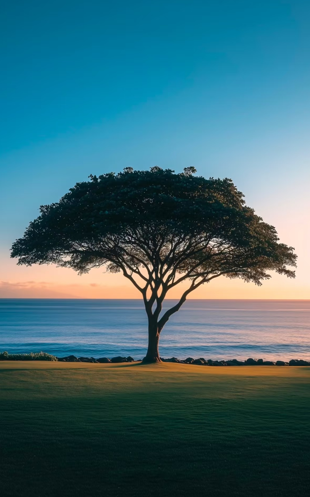

## **01 写在前面** {#2ef6628b00a18188b603ee84514c18bc}

Hi,朋友,你好哦。

欢迎来到我2026年的第一篇周记。

**为什么要重启周记?**

2025年底,经历了一些人生的转折:换了新工作,换了新的住所，与一些朋友分别，生活翻开了新的一页。

在那段时间里,我发现自己容易陷入思绪的漩涡,反复回想过去,焦虑未来。但后来我意识到,**与其在脑海里空想,不如用文字记录下来,让生活变得可见、可感、可回顾。**

周记对我来说,不仅仅是记录,更是一种**自我观察和成长的方式**。当我把一周的经历、感受、思考写下来时,我能更清晰地看到自己在哪些方面有进步,在哪些地方需要调整。

更重要的是,**周记帮我活在当下**。它提醒我去留意生活中的小美好,去记录那些可能被遗忘的瞬间,去看见自己正在经历的变化。

2026年,我想做一个更真实、更有行动力的自己。而周记,就是我给自己的一个承诺:**认真生活,认真记录,认真成长。**

另外我也想给这个小公众号想改一个名字：**海边有棵小树。**

本周我看到这个照片，我感觉到内心无比宁静，很是喜欢。

海边：大海是我名字中的一个字，也是我很喜欢的地方，它代表着向外探索、开放、包容、变化和丰富。

小树：一棵小树在海边静静生长，不喧嚣，不随波逐流，既看到了大海外面的辽阔，又能坚定自己的内心，向下扎根，向上生长。

## **02 本周最爱歌曲推荐** {#2ef6628b00a181089082ef0c3824ce07}

🎵 **《孔雀(一窝金孔雀)》** - 象乐队

> 听到这首歌的旋律,让我重回彩云之南。那些在云南的日子,那些自由而美好的时光,仿佛随着音乐又回到了眼前。

## **03 本周拍的最喜欢的一张图** {#2ef6628b00a181d19724c338bf3b4028}

📷 **五道口地铁站拍的落日**

> 这是我从五道口PageOne书店回家时,在地铁站拍到的。小汽车沿着落日驶向远方,红色的天空,线条感的首钢桥梁,还有那个渐行渐远的汽车身影,有种别样的浪漫。我在想即使在城市的匆忙中,也要有好奇心，看到难忘的瞬间，能及时捕捉下来。

## **04 本周最喜欢的一句话** {#2ef6628b00a18190bedde99263dbea87}

> **"要去生活、去工作、去行动,不要坐在这里苦思冥想。"**—— 易卜生《罗斯莫庄》

这句话这周特别打动我。很多时候,我们容易陷入思考的漩涡,却忘了最重要的是行动。与其纠结和焦虑,不如去做,在做的过程中找到答案。

## **05 本周读到** {#2ef6628b00a18152ae0afcb52b887674}

### 1. 《八万四千问》 {#2ef6628b00a181a7ac2cdd47393072b1}

**阅读进度**:已完成第4,5章(1/3-1/4)

**阅读感悟**:

- **幸福的本质**:我们追求的"永远快乐"本身就是幻觉。有痛苦才有对比,有苦才有甜。学会在当下找到满足感,接受生活的不完美
- **关系的真相**:"你感到孤单所以想要伴侣,又因自私想要独立"——这是现代人的困境。健康的关系不是找人填补空虚,而是两个相对完整的人选择一起成长
- **满足感可主动创造**:追求幸福就像吃饭,专注当下就会满足;一直想着下一顿,永远不会满足。减少贪欲,在过程中找到幸福
- **核心启发**:不再把"完美"当目标,学会坦诚表达需求,培养内在的满足感而非外在追逐

### 2. 《半小时漫画三国演义》 {#2ef6628b00a181909564c29092d53bad}

**阅读进度**:已完成20%

**阅读感悟**:

- **轻松有趣的学习方式**:用漫画和段子讲历史,桃园结义、三英战吕布、官渡之战这些经典故事变得生动好记。学习不一定要正襟危坐,有时候轻松的方式反而效率更高，后面会以这个方式再重温四大名著。

## **06 本周看到的新视频** {#2ef6628b00a1818dbdbef097b473e493}

## **07 本周新经历** {#2ef6628b00a181acb93ad693b3ee45ec}

### 1. 第一次在新公司做长时间分享 {#2ef6628b00a1813b88dfcc430c1caeae}

这是入职以来第一次系统性地工作分享,从准备到呈现,整个过程让我对自己的知识体系有了更清晰的认知。同事和老板的认可,也给了我很大的信心。

### 2. 开启"下班后充电"模式 {#2ef6628b00a181668cc1d4e7280cec2f}

发现下班时间比之前提前后,这周有4天时间，下班后就固定去PageOne书店自习。这种主动学习的状态,让我感觉自己在掌控生活,而不是被生活推着走。

### 3. 津旅时光号:一场关于时光的旅行 {#2ef6628b00a181eb9bd9d6b2dceb1a32}

周六,我踏上了"津旅时光号"主题列车。这不是一趟普通的火车,而是一段精心设计的时光之旅。

**民国风格的车厢**让我一秒穿越:棕红色真皮沙发、复古台灯、木纹墙面,每个细节都在诉说着那个优雅从容的年代。

**移动的文化盛宴**超出预期:京剧、相声、小提琴、民国歌舞轮番上演,演员们在车厢里巡回演出,每一次抬头都是惊喜。在6号车厢的蒙太奇幻境,我还参与了互动话剧,被拉进故事里的感觉真的很奇妙。

**9号车厢的治愈时光**:走进蒸汽朋克奇幻花园,绿植环绕,光线柔和。我体验了拓福字，看着窗外流动的风景,心是完全松弛的。

**最大的收获**:我放下了对"效率"的执念,重新发现了"在路上"的乐趣。原来,有些路是值得慢慢走的。这100分钟,是我最近最值得的100分钟。

### 4. 周天走进山野徒步 {#2ef6628b00a1819b991fe4996c3ca2ae}

周天一早参加了鳌鱼沟徒步活动。6个小时的山间行走,2万步的足迹,离开城市的喧嚣,走进山野,在冰川上行走，感受冬日阳光洒在身上的温暖,呼吸清新的空气。这种与大自然的亲密接触,让身心都得到了放松和治愈。

## **08 本周新收获** {#2ef6628b00a1819ba18fe5c08df21b55}

### 💼 工作成果 {#2ef6628b00a1811ab5aad366fb3e17c7}

- ✅ 完成重要的团队分享,赢得认可
- ✅ 推进项目研究和规划工作
- ✅ 系统梳理工作方法论

### 🌱 个人成长 {#2ef6628b00a181cf8dd5fe9bc94180b5}

- **适应力**:逐步适应新公司的节奏和文化
- **时间管理**:学会利用notion ai 提前去规划日程，利用下班后的时间充电,而不是随意玩手机消耗
- **行动力**:印证了"要去生活、去工作、去行动"这句话,很多问题在行动中就解决了
- **旅行态度:**通过津旅时光号,学会了放慢节奏,明白了旅行的意义不仅是抵达终点,更是享受路上的每一刻
- **健康意识**:从日常散步到周末徒步,运动强度逐步提升,身体正在变得更有活力
- **运动习惯建立**:连续5天完成散步打卡,周末完成6小时鳌鱼沟徒步(2万步)
- **饮食管理系统化**:成功坚持8+16进食窗口(12:00-20:00),平均每日摄入1300-1400千卡,找到了适合自己的饮食节奏
- **身体反馈感知**:开始能够清晰感受到健康管理带来的积极变化,体力提升,精神状态更好,验证了长期坚持的价值

## **09 下周需改善和期待的点** {#2ef6628b00a18171a7acff661e4c4ee4}

### 📋 下周期待清单 {#2ef6628b00a1816e974ad123ada21a44}

| 期待事项     | 期待结果                |
| -------- | ------------------- |
| 胜任新工作的挑战 | 做好充分准备,迎接更有挑战性的工作任务 |
| 优化作息时间   | 晚上11:30前休息,保证充足睡眠   |
| 坚持健康饮食   | 注意晚上饮食,保持16+8轻断食    |
| 梳理年度核心任务 | 明确今年的重点目标,下班后专注执行   |

### 💡 具体行动计划 {#2ef6628b00a181db9315de05f936e142}

**工作方面**:

- 梳理年度核心工作任务
- 为接下来的挑战做好知识储备和心理准备

**健康方面**:

- ⏰ 作息:晚上11:30前休息
- 🍽️ 饮食:注意晚餐时间和内容,保持16+8轻断食窗口(12:00-20:00)
- 💪 运动:继续保持每日散步习惯

**个人成长**:

- 下班后专注做好年度规划
- 继续去PageOne充电学习
- 保持记录和复盘的习惯

## **10 写在最后** {#2ef6628b00a18112ae8ec9e8b4c36ad1}

这一周,感觉自己在一点点找到新的节奏。

工作上的认可给了我信心,下班后的充电让我感到充实,坚持健康管理让我看到了改变的可能性。

"要去生活、去工作、去行动,不要坐在这里苦思冥想。"这句话会成为我接下来的行动指南。

2026年才刚刚开始,我想做的事还有很多。下周,继续加油!

**想到做到,得到世界的反馈,然后持续!**

最后,再次感谢朋友你的阅读。

我们,下周见。

2026/01/11 晚

北京

The End.

