## **01 写在前面** {#2ef6628b00a1817087dccf9c2fbeb36f}

Hi，朋友，你好哦。

这是2026年的我的第三周周记，本周末北京下了2026年第一场雪，鹅毛大雪很美！

上周周记发出后，收到了一些朋友的反馈，原来关于我的周常还有朋友关注哈，谢谢你们的留言和点赞。

本周，我继续在新岗位稳步推进，工作节奏逐渐找到了属于自己的状态，对业务的理解越来越深入了，新公司也给我配了新的macbook，续航很长，很好用。

生活方面也有不少亮点：和广州的朋友聊了聊天、参加了有知有行的年度复盘活动、周末带上海出差的朋友品尝了另外一位即友开的乐衢小馆，这些互动让我感受到生活的温度。

我逐步也在开始找寻自己的生活、学习的秩序，下文会详细展开讲讲。

## **02 本周最爱歌曲推荐** {#2ef6628b00a181129c75c65fb04b5712}

🎵 **《我想去拥抱微风》** - J.well

> 我想去拥抱微风 大步的向前走不担心一切磕碰 烦恼自己掉头看 那树叶梧桐 唱着喜欢的前奏不在乎一切过去的冲动 不需要皱紧眉头投 进入了彩虹 抓住现在去享受脸上有向往的笑容 跟着琴弦在跳动  
> 想要也不想带走它也不想停留那就张开双手去聆听海鸥……

这首歌的名字就很温柔，"我想去拥抱微风"，像是在追逐一种自由而轻盈的生活状态。在本周稳步前行的过程中，这首歌提醒我：生活不只是埋头赶路，也要记得抬头感受那些轻柔的、美好的瞬间。就像微风一样，虽然抓不住，但能感受到它的存在。

## **03 本周拍的最喜欢的一张图** {#2ef6628b00a181baa45efe361ba7a2cf}

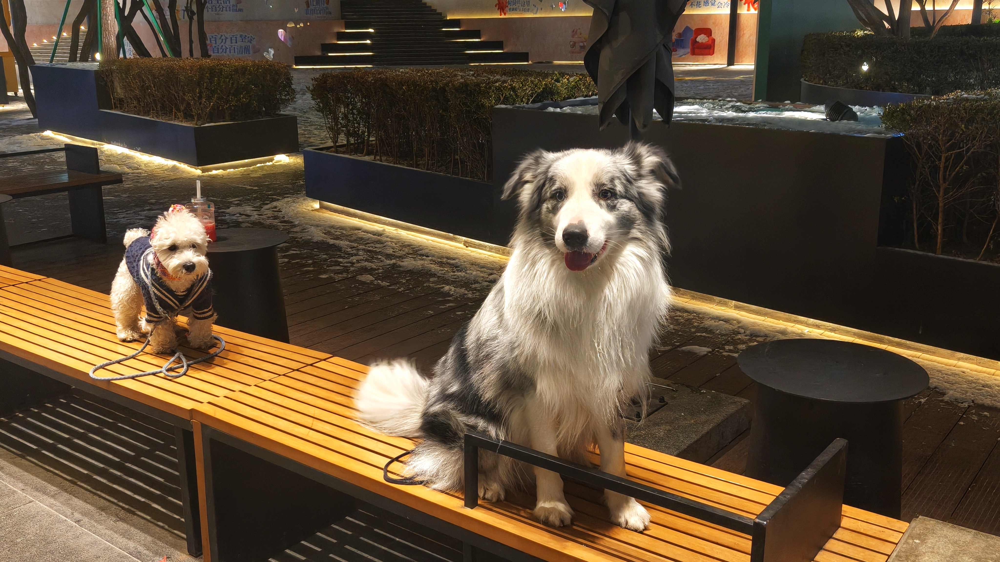

> 这张图是我周六晚上从自习的地方出门后，门外正下着大雪，有2只狗狗正在等待它们主人给投喂好吃的，它们一边冻得瑟瑟发抖，一边看着我，这俩小家伙一 “大” 一 “小” 同框，反差萌还挺可爱的！

## **04 本周最喜欢的一句话** {#2ef6628b00a18104b185c6080ae226e2}

> **"只要我们还能创造日常，就值得好好庆祝"** —— 来自路边宣传牌

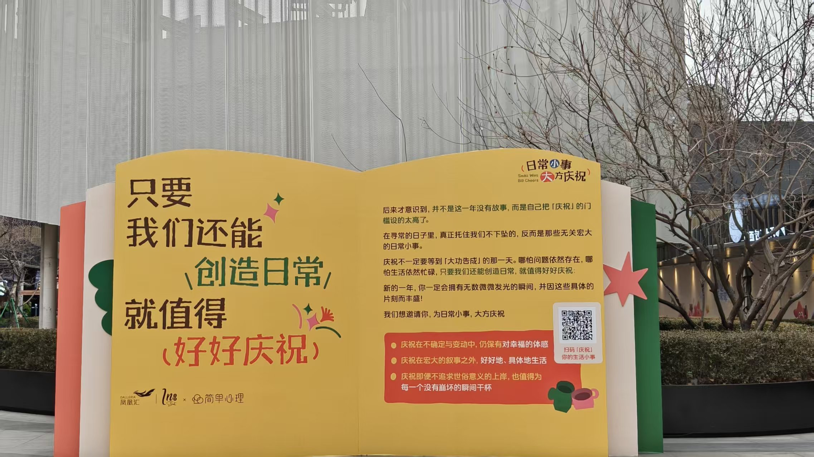

本周在三元桥的里巷看到一个关于**"日常小事 大方庆祝"**（Small Wins Big Cheers）的宣传牌，上面的文字很触动我：

后来才意识到，并不是这一年没有故事，而是自己把「庆祝」的门槛设得太高了。在寻常的日子里，真正托住我们不下坠的，反而是那些无关宏大的日常小事。

**庆祝不一定要等到「大功告成」的那一天。**哪怕问题依然存在，哪怕生活依然忙碌，只要我们还能创造日常，就值得好好庆祝。

新的一年，我会拥有无数微微发光的瞬间，并因这些具体的片刻而丰盛，这也是我想把它们在此记录的意义。

## **05 本周读到** {#2ef6628b00a181639fc3d4ef51eef9e0}

本周微信读书时间3h12min，日均阅读27min。

### 1. 《半小时漫画三国演义》 {#2ef6628b00a1811abfe6dcf5db0ce21d}

**阅读进度**：67%，正在阅读中

**阅读感悟**：

- 继续通过轻松有趣的方式补充三国知识，目前能梳理出三国主要战役的脉络了
- 但发现这本书一些细节部分还是讲的太浅了，后面把脉络梳理完，对于感兴趣的部分可以通过影视作品详细展开。

### 2. 投资理财学习 {#2ef6628b00a181169113c01a6a44625b}

**学习内容**：有知有行 + 雪球投资理财24课

**学习收获**：

- 强化了一个重要原则：**投资一定不要追高**
- 后面多多关注一些宏观数据，这部分才是经济大环境的晴雨表。

### 3. 稍后阅读文章 {#2ef6628b00a18101838dedb9fe33bbb8}

**《海外破亿阅读：在一天内，重塑你的人生》**

**核心观点**：

- **真正的改变是改变你是谁，而不只是改变行为**：成功的人不需要「咬牙坚持」，因为那种生活方式已经成为他们的一部分。如果你想减肥后又回到原点，说明你没有真正改变身份认同
- **所有行为都是目标导向的**：你的拖延、逃避都在服务某个无意识目标（比如保护自己免受评判）。真正的改变需要改变目标本身
- **智慧 = 从生活中获得你想要之物的能力**：高智慧是迭代、坚持和理解全局的能力。低智慧的标志是无法从错误中学习

**可实践的方法**：一天内重塑人生的三步法

1. **早晨 - 心理挖掘**：通过深度提问揭开隐藏动机，创建「反愿景」（你不想过的生活）和「愿景」（你想要的生活）
2. **白天 - 打破无意识模式**：设置随机提醒，用问题打断自动驾驶状态（如「我现在在逃避什么？」）
3. **晚上 - 综合洞察**：把洞察整合成行动计划，设定1年目标、1月项目、每日行动

**把人生变成电子游戏**：

- 愿景 = 如何获胜
- 反愿景 = 利害关系（输了会怎样）
- 1年目标 = 主线任务
- 1月项目 = Boss战
- 每日行动 = 支线任务
- 约束 = 游戏规则

**对我的启发**：

- 这篇文章的方法论和我的ESTJ特质高度契合：系统化、可执行、目标导向
- 「反愿景」概念很有价值：与其只想「我要变好」，不如清晰认识「我绝不想过什么样的生活」，这种负面能量更能驱动行动
- 可以尝试用文章中的「一天重塑法」做一次深度复盘，特别是那些打断无意识模式的提问很实用

## **06 本周看到的新视频** {#2ef6628b00a18115a82acc0bd5a6d98f}

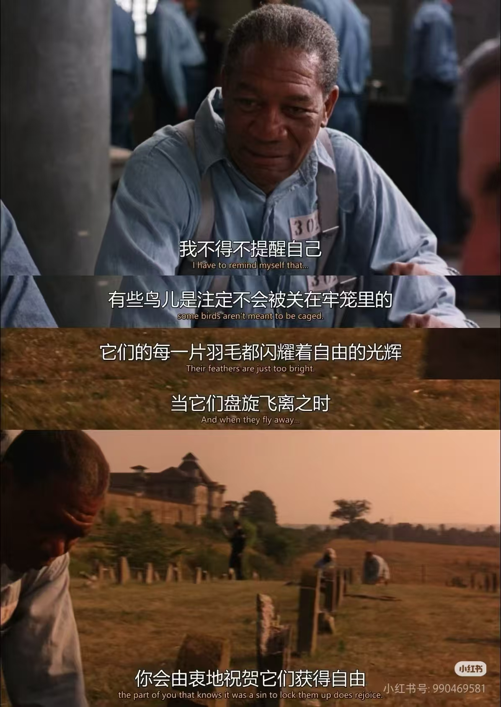

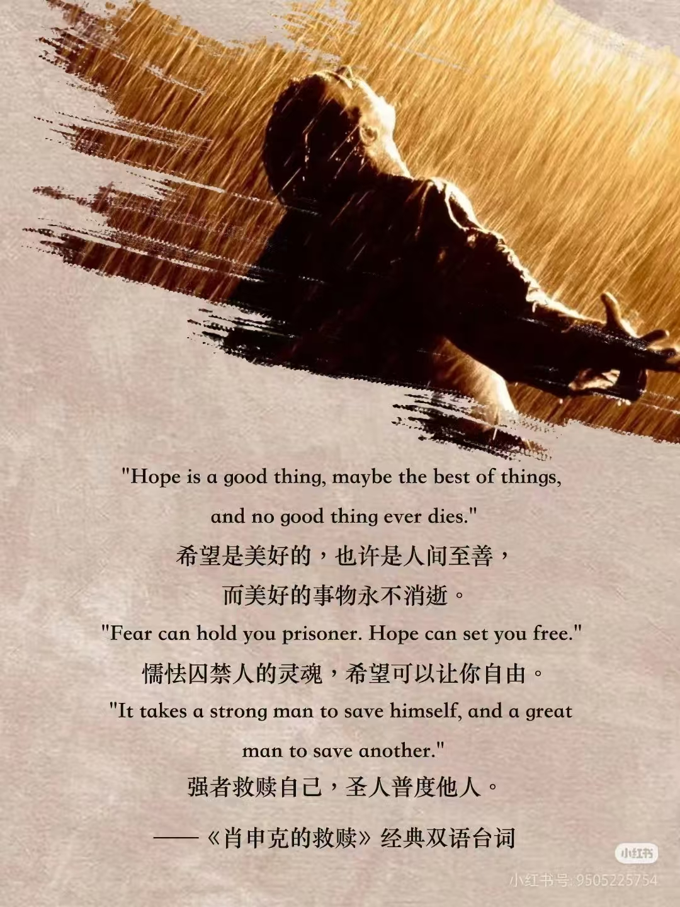

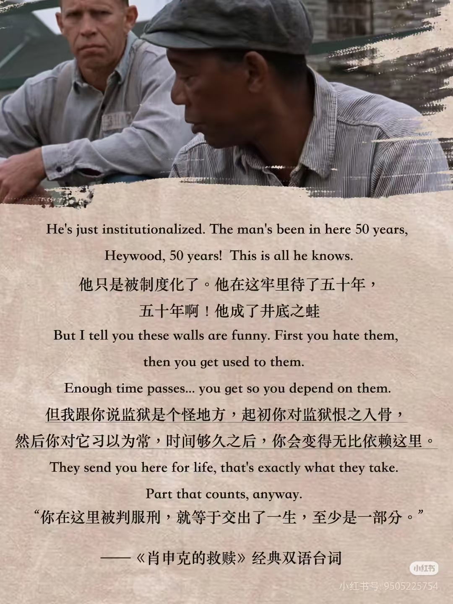

本周在VR上看完了肖申克的救赎剩下的部分，又给了我蛮多思考，希望是支撑我们持续向前的目标。

## **07 本周新经历** {#2ef6628b00a181a58fc4c9d8d83265c3}

### 1. 参加有知有行年度复盘活动「🔄我们的这一年」 {#2ef6628b00a181af9960d185e0afc9c5}

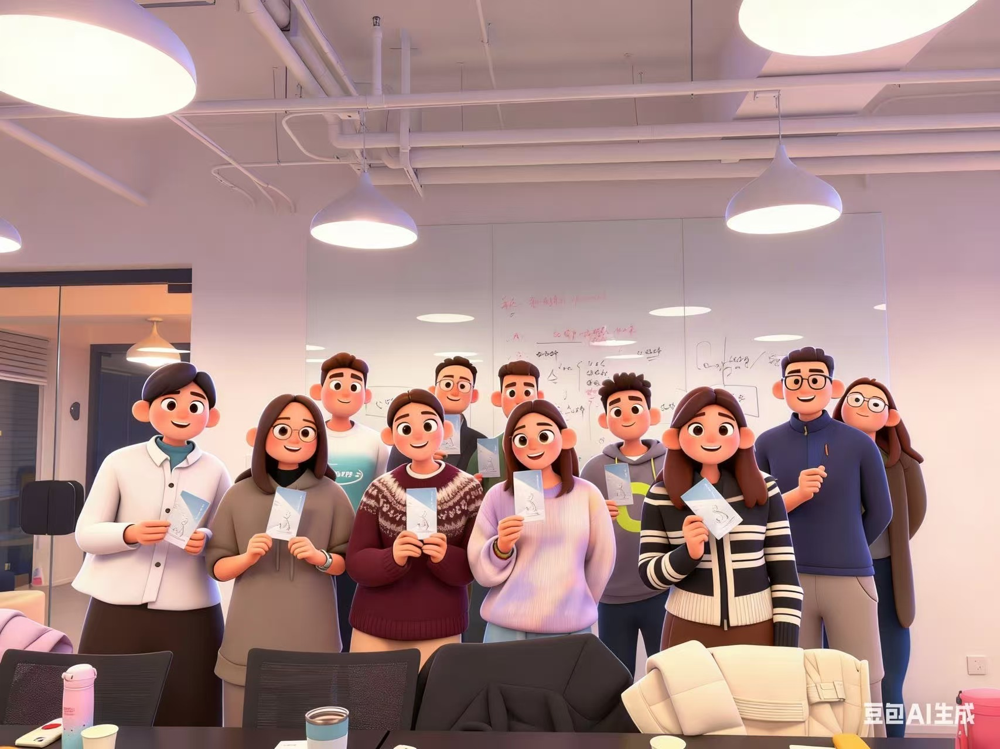

周五晚上，我参加了有知有行组织的年度复盘活动。

这是我第一次去有知有行的办公室，看到了知行小酒馆雨白的录音室，看到了他们的照片墙，感觉很亲切，让我看到了不同人在2025年的生活方式和投资经历思考。

### 2. 和广州朋友的聊聊天 {#2ef6628b00a1817a8286d2a683e8766e}

周四晚上和广州的一位朋友进行了一次远程聊天。虽然相隔千里，聊了过去一年的近况，发现大家在工作上都有蛮多困惑，但又在努力向前。

### 3. Pocket口袋啤酒屋的精酿 {#2ef6628b00a1817d8d83e523a556fd47}

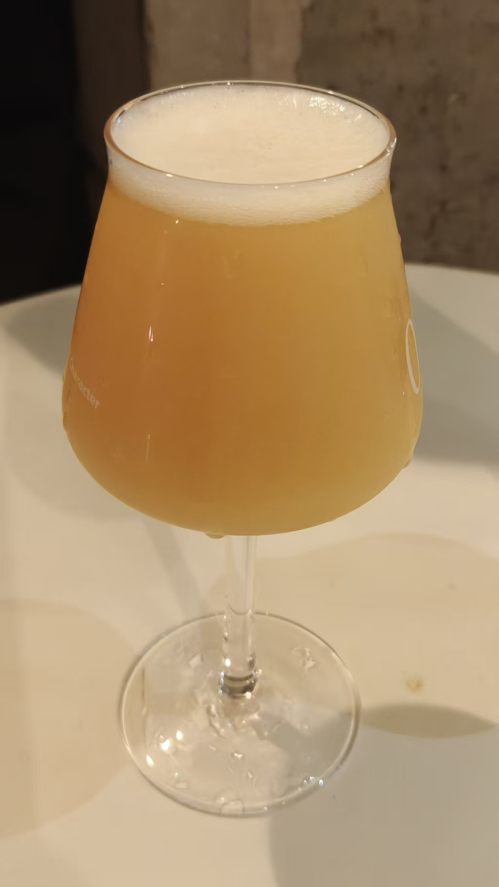

周五晚上去Pocket口袋啤酒屋，尝到了3倍帝国IPA，好喝的，也跟朋友聊了聊他们的关于精酿小程序的项目，感觉他们好有想法和执行力。

当天外面很冷，小酒馆里却很暖和，它所在的园区是海淀卫星制造厂旧址，据说是海淀的798,后面有机会再来逛逛。

### 4. 乐衢小馆与里巷 {#2ef6628b00a18159b33bd8fc53597a30}

周末带从上海出差的朋友吃乐衢小馆。

周六，Shelly来北京出差，我带着她去品尝了即友丹丹开的乐衢小馆，这是我第一次吃衢州鸭头，发现肉质很细腻，很好吃。

也跟Shelly逛了逛凤凰汇的里巷，看到了上面拍到的关于生活日常的描述，很是认同。

### 6. **冰雪奇缘-在北体雪地里跑步** {#2ef6628b00a181f19d9df94750a1780f}

为了感受北京26年的第一场大雪，今天一早便去北体校园里跑步。

在他们操场跑了7km，身体超暖和，过了会，操场上来了一群北体大学生。

他们二话不说，上来就来打雪仗，我也加入他们的打雪仗队伍之中，在操场上追逐嬉闹，感觉大学生们好有活力。打完雪仗，我们便开始堆雪人，我堆了个像小狗一样的雪人☃️，他们堆了个冰糖葫芦。还人生第一次体验了开除雪车，推着扫雪车往前走，侧面吐出碎雪，所经过之处，便干净了很多。

最后大学生们还很热情地带我去北体大食堂三楼吃新上的鸡公煲，很好吃，他们给我分享学校的趣事，我很他们分享工作上的吐槽。有一位大学生说，她毕业了想去OpenAi和特斯拉，还有一位同学给我看了她用cursor做的网球训练的小程序，我说敢想敢干就很好，你们有很多时间，都可以去尝试的。

这一聊聊了快2h，真怀念大学时光呀！

今早真是一段**冰雪奇缘**，以后有机会再来。

### 7. 本周印象深刻的感悟 {#2ef6628b00a181c58b74c9fdf5632173}

周三坐地铁时突然意识到：**这个世界绝大多数陌生人，我们大概率一生只见一次。** 这让我更珍惜每一次相遇，也更珍惜那些会反复相见的人。

## **08 发现有趣的产品** {#2ef6628b00a18188b6a8c6ce928f0279}

### 1. qdav夸克网盘挂载工具 {#2ef6628b00a18117a2d0e5d1beaa7ec6}

为了将我的VR与夸克网盘里的视频打通，这周意外发现了这款工具，扫码登录后，即可将网盘里视频同步到webDav。

### 2. Younews {#2ef6628b00a181748be9eb2b98982a01}

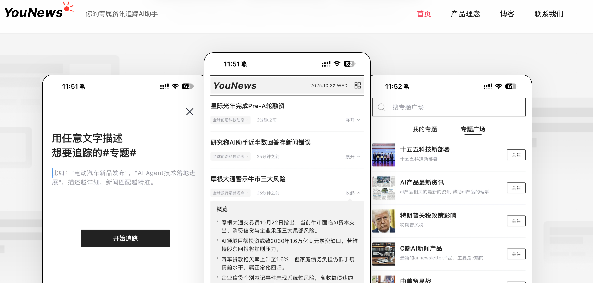

最久我一直在找一款好用的资讯，新闻主题订阅的软件，相比刷新闻，我更喜欢订阅我感兴趣的内容。意外发现了搜狐近期出的这款Younews ，很好用。

我给开发者反馈能不能实时订阅马斯克的推特，他们当天就帮我实现了这个功能，很不错。

它们的博客也很值得读一读：[https://www.younews.cn/blog/from-rss-to-semantic-tracking.html](https://www.younews.cn/blog/from-rss-to-semantic-tracking.html)

## **09 我的创造** {#2ef6628b00a18132a15df066b0ccf777}

如果只是输入，学习，不去创造，做一些什么事情，就会很容易陷入学生思维，所以后面我会把我利用AI学到的知识，做成一个个小产品，上架给大家使用体验。

### 1. 我的个人博客 {#2ef6628b00a181d98c8be769dbab74ba}

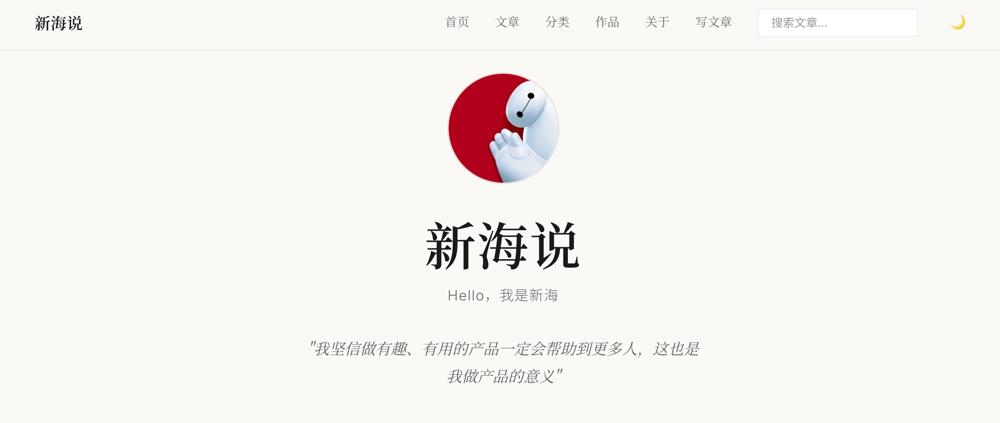

这周我用Cursor搭建了一个我个人很喜欢的极简博客，后面的周记也会同步到我的博客里。

这是我的个人博客地址：[https://xinhaiblog.vercel.app/](https://xinhaiblog.vercel.app/)

### 2. **公众号 Markdown 编辑器** {#2ef6628b00a1813fb9a4d502a221fa3a}

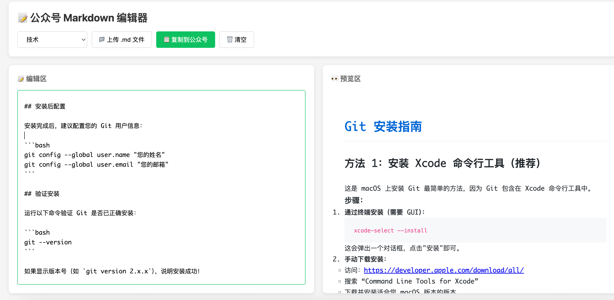

为了方便将notion或markdown 格式的文章更方便排版到公众号，这周我用Cursor搭建了个编辑器，目前已经发布到网上。

体验地址：[https://11-markdon-to-notion-wechat.vercel.app/](https://11-markdon-to-notion-wechat.vercel.app/)

如果大家感兴趣，后续我可以把读书笔记和AI学习笔记分享到我的这个公众号里。

## **09 我的改变** {#2ef6628b00a181aaa151e2d5d1d089fa}

### 🌱 个人成长 {#2ef6628b00a1813cbedbe5d2a9853a97}

- **运动习惯建立**：连续5天完成散步打卡（1月13-17日），虽然是低强度运动，但贵在坚持。这是"不费脚训练计划"的良好开端。
- **饮食管理持续**：本周继续执行8+16进食窗口，大部分时间能保持在12:00-20:00的进食时段
- **学习主线明确**：工作上认真研究数数、梳理产品打点规划；生活上看有知有行+学习雪球投资理财知识，学习AI。
- **认知更新**：通过本周的思考，也意识到"好用的产品会让生活变得更好"。
- **关系经营**：与广州，上海的朋友保持联系，与好久不见的朋友即使聊聊天，让我感受到友情的温暖。
- **工作融入**：从具体事务的推进中，对新公司的业务理解越来越深入，适应期进展顺利。
- **专注的环境**：

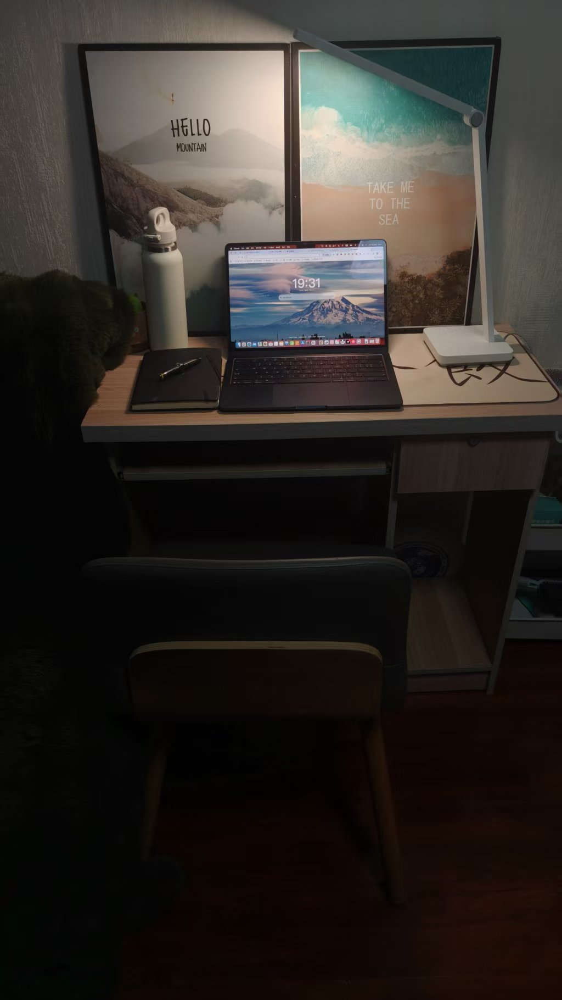

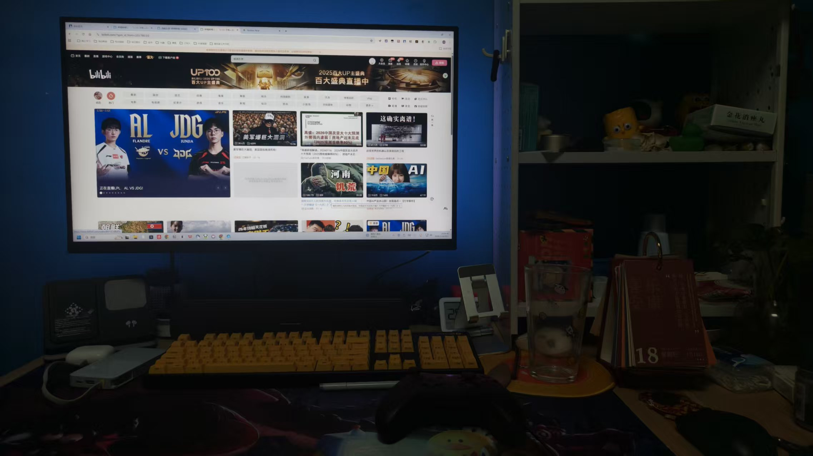

娱乐和学习分开。

最久我在想玩要玩的专注，学要学的投入，两者应该分开明确的界限，而非让自己的注意分散。

从最近北京实在太冷了，只去了3天Pageone自习，后来我在家里也搭建我自己的自习小桌，区分于我的娱乐吃饭桌，我给自己的原则是一旦进入自习模式，手机静音，放到2米之外的地方，每完成一个待办，再去碰手机。

## **10 下周需改善和期待的点** {#2ef6628b00a181cb88b2ccd416c2073a}

### 📋 上周期待回顾 {#2ef6628b00a18165b091fe6c2b5ac6c6}

上周你期待的事项：

- 胜任新工作的挑战
- 优化作息时间（晚上11:30前休息）
- 坚持健康饮食（16+8轻断食）
- 梳理年度核心任务

### 📋 下周期待清单 {#2ef6628b00a181c28b3ed664bbfc5293}

| 期待事项   | 期待结果                          |
| ------ | ----------------------------- |
| 坚持运动打卡 | 继续每日散步习惯，尝试增加2次室外跑步，加1-2次室内运动 |
| 深化工作理解 | 创建开发者账号，梳理后续工作任务，             |
| 完成本周周记 | 记录好本周的生活点滴，保持复盘习惯             |

## **10 写在最后** {#2ef6628b00a181e4a9fac34598eb22ef}

从上周的"重启生活"到本周的"稳步前行"，我看到了自己的进步：**不再急于求成，而是踏踏实实做好每一天。**

工作上，一个个具体任务的完成，让我对新公司的业务有了更深的理解。生活上，开始找到自己的节奏，也能跟朋友们聊聊天，交换不同的心得。

这一周，**从"重启"到"稳步"**，我在用行动证明：改变不是一蹴而就的，而是日复一日的积累。

**想到做到，得到世界的反馈，然后持续！**

最后，再次感谢朋友你的阅读。

我们，下周见。

2026/01/19 晚

北京

The End.

